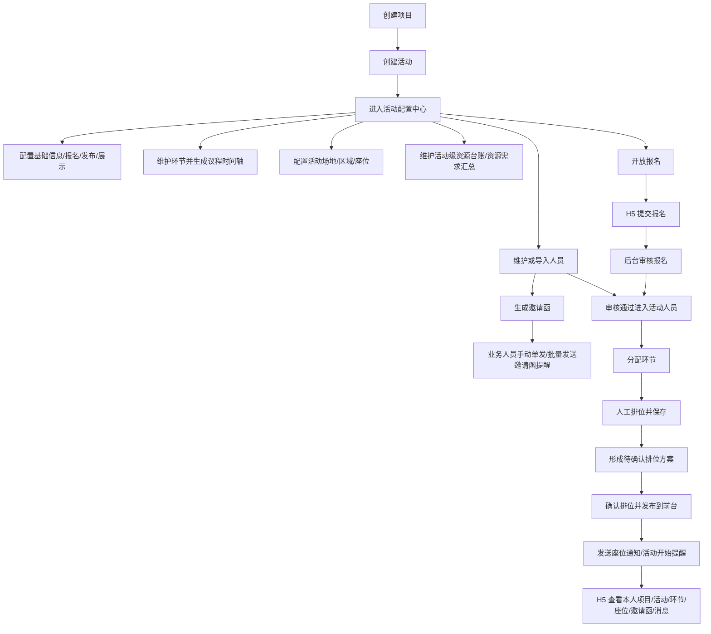

# 活动运营平台一版本项目落地说明文档（开发版）

生成日期：2026-08-04  
适用对象：开发、测试、产品、项目管理  
基准范围：《活动运营平台一版本范围汇报_20260731.md》  
参考材料：《活动运营平台项目需求文档_V1.0_20260730.md》  
版本定位：面向敏捷开发的一版本最小闭环说明，不作为大而全 PRD。

---

## 1. 文档结论

一版本以“一场活动从创建到举办的完整流程”为唯一建设核心。系统先建设后台 Web 管理端和移动公众端 H5 两端，跑通活动创建、筹备配置、嘉宾邀请、报名审核、人员入库、排位安排、消息触达和移动端本人信息查看。

当前 V1.0 PRD 中已明确的大部分业务规则可以支撑开发，但仍存在部分“建议方案、待确认、P1/P2扩展、历史需求池内容”。开发落地时应按本文件收敛：

1. 一版本只做 P0 最小闭环。
2. 不建设移动执行端、移动指挥端、完整采购比价、完整资源调度闭环、智能排位、统一审批中心、复杂统计分析。
3. 后台邀请函管理、邀请函生成、下载文件纳入一版本。
4. H5 查看邀请函、站内信、参与项目信息、活动信息、环节信息、座位信息、人员信息维护纳入一版本。
5. 所有仍未明确但不影响主流程的细节，按“开发默认口径”先实现，后续通过敏捷迭代调整。

---

## 2. 一版本范围对齐检查

| 范围项 | 范围汇报口径 | 当前 PRD 状态 | 开发版处理 |
|---|---|---|---|
| 项目管理 | 纳入后台 P0 | 已纳入，但字段仍有待确认 | 纳入一版本，按最小字段实现 |
| 活动管理 | 纳入后台 P0 | 已纳入 | 纳入一版本，活动类型为自主策划、配套活动 |
| 活动配置 | 纳入后台 P0 | 已纳入 | 纳入一版本，作为活动详情下配置中心，包含基础配置、议程时间轴、环节配置、活动级资源台账、资源需求汇总、完整性汇总 |
| 议程/环节 | 纳入后台 P0 | 已纳入 | 作为活动配置子功能，环节保存后按时间自动生成并刷新议程时间轴，支持边看图面效果边调整环节 |
| 场地配置 | 纳入后台 P0 | 已纳入 | 作为活动配置子功能，维护活动关联场地、区域、座位基础信息，供环节排位引用 |
| 活动级资源台账/资源需求 | 纳入活动配置 | PRD 有用车、用餐、住宿、物料、场地、供应商服务等资源说明 | 纳入一版本轻量记录，活动级资源台账维护用车、用餐、住宿、物料；场地以活动场地/空间配置为准并进入需求汇总；供应商本期只做供应商管理和历史报价维护，不做活动关联；不做库存、领用、派单、供应商协同闭环 |
| 人员管理 | 纳入后台 P0 | 已纳入 | 纳入一版本，按全量人员库、项目人员、活动人员、环节人员分层实现 |
| 排位管理 | 纳入后台 P0 | 已纳入 | 纳入一版本，包含场地库和排位方案两块；排位方案支持人工排位、确认、H5 查看座位 |
| 邀请函管理 | 纳入后台 P0 | 已纳入 | 纳入一版本，模板/素材、生成、下载、记录 |
| 报名人员列表/审核 | 纳入后台 P0 | 已纳入 | 纳入一版本，作为项目/活动业务相关页面处理；报名记录必须关联具体项目和活动，审核通过进入活动人员 |
| 消息能力 | 纳入后台 P0 | 已纳入，但短信平台细节未定 | 纳入一版本，站内信必须做，短信按平台条件对接；后台作为系统规则和发送记录能力，不拆独立业务菜单 |
| H5 项目展示 | 纳入 H5 P0 | 已纳入 | 纳入一版本 |
| H5 活动展示 | 纳入 H5 P0 | 已纳入 | 纳入一版本 |
| H5 个人信息 | 纳入 H5 P0 | 已纳入 | 纳入一版本，按全量人员库信息表维护个人信息 |
| H5 参与信息 | 纳入 H5 P0 | 已纳入 | 纳入一版本，展示参与项目、活动、环节 |
| H5 座位信息 | 纳入 H5 P0 | 已纳入 | 纳入一版本，只展示本人座位 |
| H5 邀请函查看 | 纳入 H5 P0 | 已纳入 | 纳入一版本 |
| H5 活动报名 | 纳入 H5 P0 | 已纳入 | 纳入一版本 |
| H5 消息中心 | 纳入 H5 P0 | 已纳入 | 消息查看和已读/未读状态记录纳入一版本，不展示未读数，不做全部已读 |
| 供应商管理/历史报价 | 范围汇报未纳入核心闭环 | PRD 中 P1 存在 | 一版本尽可能保留，优先级最后；以供应商主体为主，支持供应商历史报价记录和附件上传/查看，不做比价流程 |
| 签到核验/已核验 | 范围汇报未纳入执行端 | PRD 中有部分描述 | 一版本完全移除，不做个人码、签到核验、已核验或现场放行闭环 |
| 人员到离行程与服务安排 | 范围汇报未列为核心 | PRD 中 P1 存在 | 一版本保留项目/活动级归集汇总能力；到离行程记录参与人员自身来程/返程信息，不进入活动资源台账；用车/用餐/住宿服务安排作为后台保障记录，可绑定人员并在 H5 展示；不做派单、供应商协同、执行回执等完整调度闭环 |
| 工作台/统计/复盘 | 范围汇报暂不做复杂统计 | PRD 中有 P1/P2 | 一版本不建设工作台看板、统计分析、复盘报告；最多保留基础列表查询 |

---

## 3. 已明确可直接开发内容

### 3.1 建设端

| 端 | 建设内容 |
|---|---|
| 后台 Web 管理端 | 项目管理、项目下活动管理、活动配置中心（基础配置、议程时间轴、环节配置、活动级资源台账、资源需求汇总、完整性汇总）、分层人员管理、项目/活动下报名人员列表与审核、邀请函管理、排位管理（场地库、排位方案）、人员行程与服务（到离行程记录、人员服务安排汇总）、供应商管理/历史报价、系统管理（权限、消息规则、消息发送记录） |
| 移动公众端 H5 | 项目展示、活动展示、个人信息、参与项目/活动/环节、座位、邀请函、报名、消息中心 |

### 3.2 不建设内容

| 不建设内容 | 一版本处理 |
|---|---|
| 移动执行端 | 不做工作人员现场核验、执行反馈 |
| 移动指挥端 | 不做现场指挥看板 |
| 完整采购比价 | 不做供应商比价、评分、排名、选定 |
| 完整资源调度闭环 | 不做酒店、车辆、餐饮、物料派单、库存领用、供应商协同、执行回执；但保留人员到离行程记录、用车/用餐/住宿/物料等资源或服务记录、场地/空间配置、资源需求汇总和人员行程/服务展示；供应商本期只维护供应商主体和历史报价附件 |
| 智能排位 | 不做算法排位，只做人工排位 |
| 统一审批中心 | 不做平台级审批，只做报名审核、排位确认等局部动作 |
| 复杂统计分析 | 不做经营分析、复盘报告、多维看板 |

### 3.3 已明确业务规则

| 规则编号 | 规则 |
|---|---|
| R-001 | 一版本围绕单场真实活动闭环建设，不扩展平台化能力 |
| R-002 | 手机号不作为人员唯一标识，允许多人共用手机号 |
| R-003 | 活动人员数据来源由系统按入口生成，包括后台新增、导入嘉宾、项目人员分配、H5 报名审核通过 |
| R-004 | H5 报名按全量人员库信息表采集姓名、性别、国别/地区、籍贯、证件类型、证件号码、职务、手机号、邮箱、语种；姓名、性别、证件类型、证件号码、职务、手机号必填；手机号同步汇总到当前人员联系方式 |
| R-005 | 报名审核通过后进入活动人员范围 |
| R-006 | 议程由活动环节的时间、地点、说明自动形成，不建设复杂议程编排 |
| R-007 | 排位采用人工排位，不做智能排位 |
| R-008 | 排位结果确认后，H5 只展示当前人员本人座位 |
| R-009 | 邀请函管理、生成、下载属于一版本后台范围 |
| R-010 | H5 可查看本人邀请函，不展示他人邀请函 |
| R-011 | 消息能力支持站内信和短信，至少要支撑报名结果、邀请函提醒、座位通知、活动开始提醒；发送动作从对应业务页面发起，系统管理查询规则和记录 |
| R-012 | H5 只展示当前身份可见的本人项目、活动、环节、座位、邀请函和消息 |
| R-013 | 不建设统一审批中心，报名审核和排位确认属于局部业务动作 |

---

## 4. 一版本最小业务闭环

### 4.1 主链路

### 4.2 最小闭环验收

| 闭环 | 开发必须实现的结果 |
|---|---|
| 活动配置闭环 | 可创建项目、活动，进入活动配置中心，完成基础配置、议程时间轴、环节配置、活动级资源台账、资源需求汇总和完整性提示 |
| 邀请闭环 | 以后台发函文件模板为主，可生成邀请函并下载 PDF/Word 文件；H5 读取同一批邀请函记录和当前启用的移动端展示样式展示本人邀请函，不重新选择邀请人员；邀请函提醒由业务人员在生成成功后手动单发或批量发送 |
| 报名闭环 | H5 可报名，后台可审核，审核通过后进入活动人员 |
| 人员闭环 | 后台可新增/导入人员，可加入活动，可分配环节 |
| 排位闭环 | 后台可基于活动人员人工排位，保存后形成待确认方案，确认后发布到 H5，H5 可查看本人座位 |
| 消息闭环 | 后台可发送站内信/短信提醒，排位确认后可触发座位通知，H5 可查看消息 |
| 参与闭环 | H5 可查看本人参与项目、活动、环节、座位、邀请函和消息 |

---

## 5. 开发默认口径

以下事项在 PRD 中存在“建议方案”或“待确认”表述，但为避免阻塞敏捷开发，一版本按以下默认口径先实现。

| 事项 | 开发默认口径 | 是否需要业务再确认 |
|---|---|---|
| 项目业务状态 | 使用“未开始、进行中、已结束” | 否，除非业务要求归档 |
| 项目发布状态 | 使用“未发布、已上架、已下架” | 否 |
| 活动业务状态 | 使用“未开始、进行中、已结束” | 否 |
| 活动发布状态 | 使用“未发布、已上架、已下架” | 否 |
| 环节状态 | 使用“正常、作废” | 否 |
| 报名状态 | 使用“已提交、审核通过、审核不通过” | 否 |
| 排位状态 | 使用“待确认、已确认、已退回、已作废”；保存排位配置后即为待确认，不设置草稿 | 否 |
| 邀请函生成结果 | 不维护业务状态；成功生成记录和文件，失败记录在操作日志/生成结果中，可重新生成 | 否 |
| 站内信状态 | 使用“未读、已读” | 否 |
| 项目新增字段 | 项目名称、项目地点、开始时间、结束时间、总预算、主办单位、承办单位、支持单位、指导单位、项目简介 | 低 |
| 活动新增字段 | 活动类型、活动名称、活动地点、开始时间、结束时间、总预算、主办单位、承办单位、支持单位、指导单位、活动简介、图片/视频 | 低 |
| 项目/活动单位字段 | 主办单位、承办单位、支持单位、指导单位本期均做文本输入，不做字典维护或组织库选择 | 否 |
| 活动类型 | 使用“自主策划、配套活动” | 否 |
| 全量人员库信息字段 | 姓名、性别、国别/地区、籍贯、证件类型、证件号码、职务、联系方式、邮箱、语种；联系方式可记录手机号或电话，邮箱单独维护 | 否 |
| 后台人员录入校验 | 管理后台新增、编辑、导入人员不直接套用 H5 报名必填规则；按全量人员库自身保存规则校验，证件类型和证件号码如填写则参与唯一校验 | 否 |
| 项目人员关系字段 | 项目层支持项目人员查询、新增、导入、编辑、移除；新增后可继续分配到具体活动；不直接维护活动层来源、分组、负责人等关系字段 | 否 |
| 活动人员关系字段 | 活动层维护当前活动关系字段：来源、分组、负责人、备注、数据来源；数据来源由系统按入口生成，只读展示；报名状态、邀请状态、座位绑定、资源/行程绑定属于活动内业务状态或业务关联结果，不写入全量人员主档 | 低 |
| 环节人员关系字段 | 环节层维护当前环节执行关系字段：环节身份、来源、分组、负责人、备注；环节人员支持新增、从全量人员库选择、导入、引用本活动其他环节人员；若人员尚未在当前活动内，系统需同步补齐当前活动人员关系和项目人员关系 | 低 |
| H5 个人信息维护 | 按全量人员库信息表支持个人信息维护：姓名、性别、国别/地区、籍贯、证件类型、证件号码、职务、手机号、邮箱、语种；手机号同步汇总到联系方式；不直接套用 H5 报名必填规则 | 否 |
| 报名字段 | 必须按全量人员库信息录入：姓名、性别、国别/地区、籍贯、证件类型、证件号码、职务、手机号、邮箱、语种；姓名、性别、证件类型、证件号码、职务、手机号必填；手机号同步汇总到当前人员联系方式 | 否 |
| 证件字段 | H5 报名中证件类型、证件号码必填；后台人员库和 H5 个人信息维护不因报名规则强制必填，但同一证件类型 + 证件号码在全量人员库内唯一 | 否 |
| 报名取消 | 一版本不支持 H5 自助取消，由后台人工处理 | 否 |
| 名额控制 | 一版本不限制报名名额，不按人数上限阻断提交 | 否 |
| 重复报名 | 同一活动下同一证件类型 + 证件号码重复报名时提示已提交，不新增正常报名记录 | 否 |
| 多人共用手机号 | H5 页面入口使用手机号验证；同一手机号关联多人时，进入人员选择页；手机号写入或更新所选人员联系方式，但不作为唯一人员标识 | 否 |
| 短信平台 | 站内信提醒类型和短信模板先按本文件落地；若短信接口未就绪，先完成短信发送任务、发送记录和接口预留 | 高 |
| 邀请函发函文件模板 | 后台采用写死样式布局结构，支持配置邀请人名称、正文内容、落款信息，用于生成和下载本地邀请函文件 PDF/Word | 否 |
| H5 邀请函展示样式 | H5 页面布局写死，支持维护展示样式列表并一次只启用一个；H5 展示读取已生成邀请函记录，不参与邀请函生成流程 | 否 |
| 邀请函下载 | 下载本地发函文件，支持 PDF/Word 单个下载；批量下载按压缩包任务实现，采用一版本默认命名和上限规则 | 否 |
| 消息已读 | H5 查看消息后记录已读状态；不展示未读数，不做全部已读操作 | 否 |
| 权限 | 一版本按角色 + 按钮控制，先不做复杂数据隔离模型 | 中 |

---

## 6. 仍需业务确认事项

以下事项不是重新设计需求，而是当前开发前需要业务确认或产品拍板的内容。

### 6.1 阻塞开发的确认项

| 编号 | 事项 | 需要确认的问题 | 不确认影响 | 建议确认时间 |
|---|---|---|---|---|
| C-DEV-001 | 短信平台接入材料 | 一版本已确认需要真实发送短信；需业务/技术提供短信供应商、账号、签名、模板审核结果、回执对接方式 | 影响短信真实触达；不影响站内信、短信任务记录和接口预留开发 | 消息模块联调前 |

### 6.2 不阻塞主流程但需补充的确认项

暂无。原不阻塞主流程的确认项已按业务反馈收口为一版本默认开发口径。短信发送、批量发送、重发权限不再作为阻塞确认项，按 8.5.1 推荐方案先开发。

### 6.3 从一版本开发范围移出的内容

| 内容 | 移出原因 | 后续版本建议 |
|---|---|---|
| 活动维度报价入口 | 一版本不做采购比价 | V1.1 |
| 签到核验/已核验/个人码 | 一版本完全移除，不做现场核验闭环 | 后续如业务重新提出再单独立项 |
| 工作台看板/统计分析 | 不影响主流程跑通；一版本最多保留基础列表查询 | V1.1 |
| 复盘报告 | 不影响活动举办前闭环；一版本不做报告生成 | V1.1 |
| 复杂数据隔离/区域维度 | 一版本按授权活动和角色控制即可 | V1.1 |

---

## 7. 开发模块拆分

### 7.1 后台 Web 管理端

| 模块 | 一版本功能 | 关键输出 | 优先级 |
|---|---|---|---|
| 项目管理 | 项目列表查询、新增、详情、编辑、删除/下架、发布状态控制 | 项目基础信息和前台展示控制 | P0 |
| 活动管理 | 作为项目管理下的业务相关页面，不作为独立一级菜单；从项目详情进入活动列表、新增、详情、编辑、删除/下架；活动详情作为活动配置、人员、报名、排位和邀请函的统一入口 | 活动基础信息和活动详情入口 | P0 |
| 活动配置中心 | 配置项查询、资源需求汇总、配置项完成情况、缺失项跳转、待处理项查看；不直接承载发布状态、H5 展示开关和报名开关的操作 | 活动配置结果、资源需求汇总和配置项提示 | P0 |
| 活动配置-议程时间轴/环节配置 | 从活动配置中心进入；保持议程时间轴和环节配置联动工作台体验；环节列表查询、新增、详情、编辑、删除/作废环节，维护环节日期、开始时间、结束时间、议程线/展示线路、线路内排序、地点/区域文本、负责人、备注、人员/排位/资源需求开关；议程线必须由业务显式配置，新建环节可默认主线但字段必须可见、可改；一版本只允许“一个活动一条主线 + 若干支线/并行环节”，不支持活动内多主任务流；普通环节地点可先用文本录入，基础字段和议程线校验合法即可保存环节，保存后按时间和议程线实时刷新议程时间轴；开启排位仅生成“排位未配置”提示和配置入口，不要求先完成场地空间引用或排位方案 | 环节节点和议程时间轴 | P0 |
| 活动配置-活动场地/空间配置 | 从活动配置中心进入；维护当前活动使用的场地、区域分布图、座位编号或点位，作为活动级空间底图；不作为新增环节的前置条件；仅在环节开启排位或需要精确空间引用时使用；不在此处配置具体环节的人员排位结果 | 活动场地空间底图和座位基础数据 | P0 |
| 活动配置-活动级资源台账/资源需求 | 从活动配置中心或环节配置进入；资源列表查询、新增、详情、编辑、删除/作废，按用车、用餐、住宿、物料等类型统一维护活动级资源记录；场地需求以活动场地/空间配置为准，只纳入资源需求汇总，不再单独建立场地资源记录；供应商本期只做供应商管理和历史报价维护，不进入活动资源台账；环节只声明是否需要某类资源、处理要求和落实方式，不在环节内独立维护资源主记录；支持按资源类型、环节、人员汇总需求 | 活动级资源台账、环节资源需求声明和需求汇总 | P1 |
| 人员管理-全量人员库 | 全量人员列表查询、新增、详情、编辑、删除/禁用、导入，维护人员基础信息 | 全量人员主档 | P0 |
| 人员管理-项目人员 | 从项目详情进入；项目人员列表查询、新增/选择、导入、详情、编辑、移除项目关系，并可继续分配到具体活动；项目层不直接维护活动层来源、分组、负责人 | 项目范围人员关系 | P0 |
| 人员管理-活动人员 | 从活动详情或活动配置中心进入；活动人员列表查询、新增/选择、导入、详情、编辑、移除当前活动关系，维护来源、分组、负责人、备注；数据来源由系统生成只读展示 | 活动人员关系 | P0 |
| 人员管理-环节人员 | 从环节配置或活动人员详情进入；环节人员支持新增、从全量人员库选择、导入、引用本活动其他环节人员；维护环节身份、来源、分组、负责人、备注；若从环节入口新增、选择或导入的人员尚未在当前活动内，系统自动补齐活动人员关系和项目人员关系，避免必须先到上级人员页面配置 | 环节人员关系 | P0 |
| 邀请函管理 | 独立模块；菜单拆为发函文件模板、H5展示、生成记录。发函文件模板支持列表查询、新增、详情、编辑、删除/禁用，并可进入生成邀请函和查看记录；生成邀请函时只选择项目/活动、邀请人员范围和发函文件模板；生成后形成 PDF/Word 文件、邀请函记录和 H5 展示地址；H5展示读取同一邀请函记录和当前启用样式，不重新选择人员或模板；提醒需从生成记录页查看人员名单并二次确认后手动单发或批量发送 | 邀请函文件、H5 展示结果和生成记录 | P0 |
| 报名人员列表与审核 | 作为项目/活动下的业务相关页面，不作为独立一级菜单；可从项目详情或活动详情进入；报名记录必须关联项目和活动，当前活动上下文列表不重复展示所属活动，项目级/跨活动汇总列表需展示所属项目和所属活动；查询报名记录，查看报名详情，删除/作废异常报名记录，审核通过、审核不通过、记录原因 | 报名记录、审核结果和活动人员关系 | P0 |
| 人员行程与服务-到离行程记录 | 从项目、活动、人员详情进入；后台支持新增、编辑、导入、查询参与人员来程/返程信息；以项目级归集为主，支持关联具体活动或活动人员，满足不同活动人员不同来返程的汇总查询；H5 支持本人维护；非必填 | 人员到离行程记录 | P1 |
| 人员行程与服务-服务安排汇总 | 从项目/活动进入；按项目、活动、人员汇总查看已绑定人员的用车、用餐、住宿服务安排；用车安排支持活动用车、到达接送、离开送站等场景，绑定活动人员后系统按人员自动带出对应到离行程记录，支持按抵达/离开时间、地点拆分多条用车记录，并可选记录车辆和司机信息；它是查询和汇总视图，不是新增资源或第一次绑定人员的入口 | 项目/活动级人员服务安排汇总 | P1 |
| 排位管理-场地库 | 场地库列表查询、新增、详情、编辑、删除/禁用，维护可复用场地、区域、座位编号或点位 | 场地库基础数据 | P0 |
| 排位管理-排位方案 | 从已保存的活动/环节进入；排位方案必须强关联具体环节，进入排位配置时选择该环节使用的活动场地、区域或座位点位后进行人工排位、座位调整、确认排位、退回、待确认筛选；未配置排位不影响环节正常状态和议程时间轴展示 | 环节排位状态和已确认座位结果 | P0 |
| 系统管理-消息规则/发送记录 | 消息模板不作为业务页面配置；系统预置报名结果、邀请函提醒、座位通知、活动开始提醒、行程变更提醒等规则，短信模板编码按供应商审核结果接入；报名、邀请函、排位、资源等业务页面负责生成或发起发送任务；系统管理仅查询消息规则、发送记录、触达结果和失败原因 | 消息规则、消息记录和触达结果 | P0 |
| 权限基础 | 用户角色、按钮权限 | 基础权限控制 | P0 |
| 供应商管理 | 供应商列表查询、新增、详情、编辑、删除/禁用，维护供应商主体信息 | 供应商主档 | P-last |
| 供应商历史报价 | 从供应商详情进入；历史报价记录列表查询、新增、详情、编辑、删除/作废，支持报价附件上传/查看 | 供应商历史报价附件和记录 | P-last |

后台列表通用要求：

1. 有列表的后台模块均需保留基础增删改查能力，至少包括列表查询、新增、详情、编辑、删除/下架/作废/禁用等受控处理入口。
2. 每个列表需提供基础查询条件检索；跨项目/跨活动汇总列表默认包括关键字、所属项目/活动、状态、创建/更新时间范围；当前项目或当前活动上下文页面不重复展示已锁定的项目/活动条件；涉及人员的列表需支持姓名、手机号、证件号码后四位等条件；涉及消息和邀请函的列表需支持发送/生成状态。
3. 删除功能需受权限控制，仅业务负责人、管理人员可在授权项目/活动范围内执行；运营人员默认不可删除，单独授权后才可协助。
4. 删除入口需由后端接口校验权限，不得只依赖前端按钮隐藏。
5. 已被引用的数据按引用保护规则处理，不做静默物理删除；项目/活动优先通过下架控制前台展示，环节通过作废控制后续使用，人员、模板、场地、报价等按对象特性禁用或作废，并记录操作日志。

活动配置中心层级要求：

| 层级 | 归属关系 | 开发入口 | 关键规则 |
|---|---|---|---|
| 项目 | 项目下创建活动 | 项目详情、活动列表 | 项目只作为活动上层组织和前台展示控制，不承载环节、场地、物料明细配置；项目详情先展示项目基础信息，再展示项目下活动列表；活动配置情况只在活动列表中展示已配置项/总项，不展示百分比 |
| 活动 | 活动下进入配置中心 | 活动详情、活动配置中心 | 发布状态、H5 展示开关和报名开关属于活动基础信息编辑项，可在活动列表或活动详情编辑活动时统一维护；活动配置中心只查看配置项完成情况、缺失项和待处理入口。报名开关只控制 H5 是否允许新提交报名，不等同于活动上架或展示开关；H5 可报名需同时满足项目已上架、活动已上架、展示开关开启、报名开关开启、活动未结束，关闭报名后既有报名记录和后台审核仍保留 |
| 环节 | 环节归属活动 | 活动配置-议程时间轴/环节配置 | 环节基础信息和议程线规则合法即可保存；议程时间轴由已保存环节的日期、开始时间、结束时间、议程线/展示线路和线路内排序自动生成，不作为独立保存对象；一版本按“一个活动一条主线 + 若干支线/并行环节”处理，主线/并行线由环节配置中的议程线决定，不由系统仅按第一个环节、时间先后或时间重叠自动判断；同一议程线内时间重叠、主线重叠、支线名称缺失、线路内排序冲突阻断保存；跨议程线时间重叠允许；排位、资源、场地空间等后续配置缺失不影响环节成立 |
| 场地库 | 排位管理下维护可复用场地基础数据 | 排位管理-场地库 | 场地库维护基础场地、区域、座位编号或点位，可被活动配置引用 |
| 活动场地/空间配置 | 活动引用或维护本活动使用场地 | 活动配置-活动场地/空间配置 | 场地配置以该入口为准，维护活动级场地、区域分布图、座位、点位和排位可引用的空间结构，不直接改写场地库基础数据；普通环节地点/区域可先文本录入，不依赖场地图；这里只维护空间底图，不配置具体环节的人员座位结果 |
| 环节排位方案 | 环节基于活动场地/空间配置形成座位安排 | 排位管理-排位方案、环节配置 | 排位方案必须强关联已保存环节；开启排位后如未配置方案，环节排位状态为“未配置”，但环节仍为正常环节并进入议程时间轴；同一活动区域可被多个环节引用，但每个环节分别维护自己的排位方案、版本、状态和确认结果 |
| 活动级资源台账/资源需求 | 活动维护资源主记录，环节声明资源需求和处理要求 | 活动配置-活动级资源台账/资源需求、环节配置 | 活动级资源台账包含用车、用餐、住宿、物料等资源记录；环节资源需求项是配置声明，处理要求为“落实安排”时再选择落实方式，不强制一对一绑定，并支持需求汇总；场地需求从活动场地/空间配置读取；供应商不进入活动资源台账 |
| 配置项完成情况 | 汇总活动下已启用配置能力 | 活动配置中心首页或活动列表 | 按已启用能力记录应完成项、已完成项、缺失项；页面展示已配置项/总项，不展示百分比；缺失项只提示不阻断活动发布或执行准备 |

活动资源合并口径：

| 原要求/对象 | 合并后归属 | 是否保留独立能力 | 开发说明 |
|---|---|---|---|
| 物料清单 | 活动级资源台账中的“物料”资源类型 | 不再作为独立一级模块 | 保留物料名称、类型、数量、规格、使用环节/区域、负责人、附件等字段；不做库存、领用、归还、损耗、扫码盘点 |
| 场地/空间需求 | 活动场地/空间配置 + 环节排位方案 | 保留为活动配置和排位子能力 | 活动场地/空间配置维护活动级场地底图、区域、座位编号和点位；具体人员排位必须在环节排位方案中配置并确认；作为资源需求汇总输入，不再单独建立“场地资源记录” |
| 用车、用餐、住宿 | 人员服务型安排 | 保留资源记录和人员绑定能力 | 支持活动人员绑定、需求汇总和 H5 本人服务展示；用车可分为活动用车、到达接送、离开送站等场景，可选关联到离行程记录并记录车辆、司机信息；不做派单、供应商协同、执行回执 |
| 供应商相关 | 供应商管理/历史报价 | 保留供应商主体维护和历史报价附件维护 | 本期不做活动关联供应商服务，不从活动资源台账关联供应商主档或报价附件 |

活动资源分类和关系边界：

| 资源分类 | 包含资源类型 | 统一维护位置 | 是否绑定人员 | 与环节关系 | H5 展示 | 一版本边界 |
|---|---|---|---|---|---|---|
| 人员服务型资源 | 用车、用餐、住宿 | 活动级资源台账/资源需求；用车资源记录绑定活动人员后自动带出人员到离行程记录 | 服务名单确认后绑定活动人员；绑定对象来自当前活动人员关系，不在资源内新建独立人员；到离行程关联由系统按绑定人员自动派生 | 环节可声明需要用车、用餐、住宿；处理要求为“落实安排”时，再通过落实方式新建或关联活动级资源记录；用车可按活动用车、到达接送、离开送站等场景自动匹配绑定人员的到离行程记录；未落实时可记录需求说明或缺失原因 | 绑定后展示当前人员在当前活动下的正常服务安排，可从活动详情、行程信息或我的参与入口查看；到达接送/离开送站类用车同时可在到离行程下展示 | 只做轻量记录、人员绑定、查询汇总和通知提醒；用车记录中的车辆、司机信息可选记录；不做派单、入住办理、餐券核销、执行回执 |
| 活动通用型资源 | 物料 | 活动级资源台账/资源需求 | 默认不绑定人员；如后续存在领用人、服务对象等场景再扩展 | 环节可声明需要物料；处理要求为“落实安排”时，再通过落实方式新建或关联活动级资源记录；不要求每个环节都配置资源需求 | H5 默认不展示完整物料信息，仅在与本人服务或活动说明有关时展示摘要 | 物料只做清单记录，不做库存、领用、归还、损耗、扫码盘点 |
| 场地空间型资源 | 场地、活动场地/空间配置、座位/点位、环节排位方案 | 活动场地/空间配置提供活动级底图；排位方案归属具体环节；可复用场地归属场地库 | 活动场地/空间配置默认不绑定人员；人员座位必须通过环节排位方案和座位分配形成 | 普通环节地点/区域支持文本录入；开启排位不阻断环节保存，只生成排位未配置状态；进入排位方案配置时再选择或引用活动场地/空间配置中的区域、座位或点位；同一区域可被多个环节复用，但排位方案按环节分别保存 | H5 展示活动/环节地点文本，以及当前环节已确认并发布的本人座位信息 | 场地库、活动空间快照、环节排位方案分层处理；不做独立场地资源记录、复杂场馆运营、设备巡检、现场核验 |
| 环节资源需求项 | 对上述资源类型的需求声明 | 环节配置中维护，汇总到活动配置中心 | 不直接绑定人员；人员绑定发生在人员服务型资源记录或排位结果中 | 用于标记“本环节是否需要某类资源、处理要求、落实方式、需求说明、配置状态、关联对象、缺失原因”；只有处理要求为“落实安排”时才需要选择落实方式和关联对象 | 不单独展示；只影响活动详情、议程、行程、座位等具体信息展示 | 不是资源主记录，不作为强关联关系；缺失只进入完整性提示，默认不阻断活动发布 |

开发落地口径：

1. 资源安排统一归属活动层，不归属环节；非场地资源主记录进入活动级资源台账，场地进入活动场地/空间配置，环节只做需求声明、处理要求和落实方式选择。
2. 人员到离行程记录用于记录参与人员自身来程/返程信息，以项目级归集为主，支持关联具体活动或活动人员；非必填，支持 H5 本人维护和后台导入/编辑。
3. 用车、用餐、住宿属于人员服务型资源，必须支持服务名单确认后绑定活动人员，并能按人员在 H5 查看本人服务信息；到达接送、离开送站属于用车资源记录的场景，用车记录绑定活动人员后，系统按项目/活动、人员和行程类型自动带出到离行程记录，用于按不同抵达/离开地点和时间段形成多条用车记录。
4. 物料属于活动通用型资源，一版本以记录、附件和汇总为主，不默认绑定人员；供应商本期只做供应商管理和历史报价维护，不作为活动资源类型。
5. 场地不再单独建立活动级资源记录；活动场地/空间配置是活动场地和空间底图的唯一来源，同时作为资源需求汇总和配置项检查的输入；具体排位方案必须在环节下强关联配置。
6. 环节资源需求项处理要求为“记录需求”时，可以只保存需求说明、预计数量/规模、负责人、备注等内容；处理要求为“落实安排”但未完成配置时，进入配置项缺失提示，不阻断环节保存或活动发布。

活动资源需求衔接操作口径：

| 操作位置 | 业务在这里做什么 | 不在这里做什么 | 系统联动结果 |
|---|---|---|---|
| 环节配置 | 按环节维护议程线/展示线路、线路内排序、地点/区域文本，并可勾选需要的资源类型，例如用车、用餐、住宿、物料、场地/空间；可开启排位开关；填写处理要求、落实方式、需求说明、预计数量/规模、负责人、备注 | 不录入具体车辆、酒店、餐厅、供应商报价；不直接绑定人员服务明细；不新建场地主记录；不在环节基础信息里直接完成座位分配；不要求先配置场地图才能保存环节；不要求开启排位后立即引用活动场地/空间；不根据第一个环节、时间先后或时间重叠自动改写主线/并行线；不新增活动内多主任务层级；不在环节配置中维护供应商活动关联 | 保存环节后生成或更新环节资源需求项，并按时间和议程线立即刷新议程时间轴；处理要求为“落实安排”时进入资源需求汇总待办，并按落实方式跳转到活动资源台账、活动场地/空间配置或环节排位方案；处理要求为“记录需求”时只做统计和说明，不形成待配置任务；开启排位后，环节排位状态进入未配置，进入排位方案时再引用活动场地/空间配置；议程线保存校验包括：议程线类型必选、支线必须有线路名称、活动至少保留一个正常主线环节、同一议程线时间不得重叠、主线不得重叠、同一线路内排序不得冲突 |
| 资源需求汇总 | 在活动配置中心集中查看所有环节的资源需求、处理要求、落实方式、配置状态、缺失原因；从缺失项进入对应配置入口 | 不作为独立资源维护入口，不重复录入具体资源主数据 | 作为环节配置和活动级资源管理之间的衔接页，负责汇总、筛选、跳转和状态展示 |
| 活动级资源台账 | 维护非场地资源的具体安排，包括用车、用餐、住宿、物料；用车可区分活动用车、到达接送、离开送站等场景；可从资源需求汇总或人员到离行程汇总带入资源类型、人员、时间、地点和需求说明创建记录；用车记录只需绑定活动人员，系统按绑定人员自动带出对应到离行程；可选择关联一个或多个环节需求项 | 不维护场地空间结构；不在资源记录里新建独立人员基础信息；不维护供应商活动关联；不替代人员到离行程记录；不另建独立“接送用车”对象；不要求用户逐条手动关联到离行程 | 保存资源记录后，回写关联环节需求项的配置状态；用车、用餐、住宿在名单确认后可继续绑定活动人员并形成 H5 本人服务信息；到达接送/离开送站类用车可在 H5 到离行程下展示车辆、司机、上车/下车地点等安排 |
| 活动场地/空间配置 | 维护活动使用场地、区域、座位编号、点位和空间结构；可从场地/空间需求或排位方案跳转进入 | 不再另建场地资源记录；不做物料、用车、用餐、住宿台账；不保存具体人员排位结果；不作为普通环节地点文本保存的前置条件 | 保存后回写场地/空间类环节需求项的空间底图状态，并供需要精确空间或排位的环节引用 |
| 环节排位方案 | 针对某个环节选择活动场地/区域/座位点位，维护本环节人员排位、座位调整、保存、确认、退回 | 不维护活动级场地底图；不影响其他环节的排位结果 | 保存后形成该环节待确认排位方案；确认后只发布当前环节座位到 H5，并触发座位通知 |
| H5 展示 | 展示当前人员本人可见的活动信息、环节信息、行程/服务、座位、邀请函、消息 | 不展示后台资源需求待办，不展示他人资源安排 | 只读取已配置且允许前台展示的数据；未配置时展示暂无安排或不展示入口 |

推荐业务操作顺序：

1. 在项目详情或活动列表新增/编辑活动，维护活动基础信息、发布状态、H5 展示开关和报名开关；从活动详情进入活动配置中心查看配置项完成情况和缺失项。
2. 在议程时间轴/环节配置联动工作台中维护各环节，选择议程线/展示线路和线路内排序，并勾选该环节需要哪些资源；保存后即时查看议程时间轴效果，再决定是否继续新增、编辑、作废或调整线路、顺序和时间。
3. 在资源需求汇总中查看本活动所有资源待办，按资源类型进入对应配置入口。
4. 普通环节地点/区域先在环节配置中以文本录入；只有场地/空间类需求需要精确底图、区域、座位点位或用于排位时，才进入活动场地/空间配置；用车、用餐、住宿、物料进入活动级资源台账。
5. 环节开启排位时，从排位管理进入该环节排位方案，选择本环节使用的活动区域或座位点位后进行人员排位；同一活动区域被多个环节使用时，各环节分别维护自己的排位方案。
6. 如涉及外地参会人员，先由 H5 本人维护或后台导入/编辑人员到离行程记录；到离行程以项目级归集为主，可关联具体活动或活动人员，非必填。
7. 用车、用餐、住宿属于与人有关的服务安排，可先保存待定安排；服务名单确认后绑定活动人员，绑定后 H5 本人才展示对应行程/服务信息；到达接送、离开送站作为用车场景，可根据到离行程的不同抵达/离开地点和时间段拆分多条用车记录。用车记录绑定活动人员后，系统自动带出这些人员的匹配到离行程；如一人存在多条同类行程或无匹配行程，后台提示校正或补充，不要求常规场景下手工逐条关联。
8. 活动配置中心根据环节需求项、资源台账、活动场地/空间配置、环节排位方案和人员绑定结果自动更新完整性提示。

人员到离行程记录定义：

| 问题 | 说明 |
|---|---|
| 它是什么 | 记录参与人员自身来程/返程信息的业务记录，用来回答“这个人从哪里来、怎么来、什么时候到、什么时候走”。 |
| 归属层级 | 本质上以项目级归集为主，支持关联具体活动或活动人员；同一项目下不同活动人员可以有不同到离行程。 |
| 是否属于活动资源 | 不属于活动资源台账，不作为资源主记录；它是人员出行信息，可作为用车资源安排中到达接送、离开送站场景的参考或关联来源。 |
| 维护方式 | H5 允许本人维护；后台必须支持新增、编辑、导入、查询、汇总和必要修正。 |
| 是否必填 | 一版本非必填，有则记录，用于后台保障统筹和 H5 本人查看。 |
| 示例 | 张三填写“8月9日 G1234 福州站到厦门北站 15:30 到达”；后台可据此安排接站车，但该到达记录本身不是一条用车资源。 |

人员服务安排汇总定义：

| 问题 | 说明 |
|---|---|
| 它是什么 | 按人员视角汇总平台已安排的服务，用来回答“这个项目/活动里，某个人有哪些用车、用餐、住宿安排”。 |
| 它不是什么 | 不是参与人员自己的来返程信息，也不是新增用车、用餐、住宿资源的入口。 |
| 数据从哪里来 | 服务安排来自活动级资源台账和人员服务绑定；其中用车资源记录可通过“用车场景”区分活动用车、到达接送、离开送站，并由系统按绑定人员自动带出到离行程。 |
| 到离行程与用车关系 | 到离行程作为用车资源安排的自动关联依据；一条用车记录绑定多名人员后，系统自动匹配这些人员的到离行程记录。一名人员也可有来程接站、返程送站等多条用车记录。 |
| 后台如何使用 | 运营或负责人从项目/活动进入，查询某活动下哪些人员已绑定哪些服务安排，可按人员、资源类型、时间、状态筛选，用于检查是否漏配、变更或通知。 |
| H5 如何展示 | H5 行程页展示两块内容：本人到离行程、本人的服务安排；服务安排只读取当前人员已绑定且状态正常的数据，未绑定时展示暂无安排。 |
| 示例 | 张三填写动车到达信息；后台在用车资源中创建一条“用车场景=到达接送”的记录，可选记录车辆和司机，并绑定张三、李四；张三登录 H5 可看到自己的到达行程和接站车信息。 |

### 7.2 移动公众端 H5

H5 按“页面 -> 模块 -> 一级功能 -> 二级功能”规划，页面必须围绕当前手机号验证后的人员身份展示本人可见数据，不做独立后台式菜单。

| 页面 | 所属模块 | 一级功能 | 二级功能 | 关键输出 | 优先级 |
|---|---|---|---|---|---|
| 入口验证页 | 身份识别 | 手机号验证 | 输入手机号、获取验证码、提交验证码、校验验证码有效期 | 当前手机号验证结果 | P0 |
| 人员选择页 | 身份识别 | 多人身份选择 | 同一手机号关联多人时展示可选人员，选择本人身份后进入 H5；单人匹配时直接进入 | 当前人员身份 | P0 |
| 首页/项目列表页 | 项目展示 | 查看本人可见项目 | 展示已上架且本人可见的项目列表、项目名称、项目时间、项目地点、项目状态提示 | 本人可见项目列表 | P0 |
| 项目详情页 | 项目展示 | 查看项目信息 | 展示项目名称、项目地点、开始时间、结束时间、主办/承办/支持/指导单位、项目简介；展示项目下本人可见活动入口 | 项目信息和活动入口 | P0 |
| 活动列表/活动入口页 | 活动展示 | 查看本人可见或可报名活动 | 展示项目下已上架且展示开关开启的活动；区分已参与活动、可报名活动、暂无可见活动 | 活动入口列表 | P0 |
| 活动详情页 | 活动展示 | 查看活动信息 | 展示活动类型、活动名称、活动地点、开始时间、结束时间、主办/承办/支持/指导单位、活动简介、图片/视频；承载报名、邀请函、环节/议程、行程、座位、消息等活动内入口 | 活动信息和活动内功能入口 | P0 |
| 活动报名页 | 报名 | 提交活动报名 | 按报名字段采集姓名、性别、国别/地区、籍贯、证件类型、证件号码、职务、手机号、邮箱、语种；校验必填项；提交报名；手机号同步汇总到当前人员联系方式 | 报名记录和人员联系方式更新 | P0 |
| 报名结果页 | 报名 | 查看报名结果 | 查看已提交、审核通过、审核不通过状态；审核不通过时展示原因 | 报名状态和审核结果 | P0 |
| 个人信息页 | 个人信息 | 查看和维护个人信息 | 查看和维护姓名、性别、国别/地区、籍贯、证件类型、证件号码、职务、手机号、邮箱、语种；保存后更新全量人员库本人信息；手机号同步汇总到本人联系方式 | 人员信息和联系方式更新 | P0 |
| 我的参与页 | 个人中心/参与信息 | 查看本人参与关系 | 以当前人员为对象，汇总展示本人参与项目、活动、环节；环节涉及座位时提示当前人员该环节座位信息或暂无座位；作为跨项目/活动的聚合入口，可跳转项目详情、活动详情、环节详情或对应座位信息 | 本人参与关系聚合和座位提示 | P0 |
| 环节/议程页 | 活动展示/参与信息 | 查看活动环节信息 | 以当前活动为对象，从活动详情进入；按活动议程时间轴展示本人可见环节，展示环节名称、时间、地点/区域、说明、本人环节身份或参与关系 | 当前活动下本人可见环节信息 | P0 |
| 行程页 | 活动展示/行程信息 | 查看和维护本人行程安排 | 以当前人员 + 当前项目/活动为对象，优先从活动详情进入；展示本人到离行程和本人服务安排；支持本人维护到离行程；查看已绑定的用车、用餐、住宿安排，其中用车可包含活动用车、到达接送、离开送站 | 本人到离行程和服务安排 | P1 |
| 座位信息区/座位详情 | 活动展示/座位信息 | 查看本人座位 | 以当前人员 + 当前活动 + 当前环节为对象，跟随活动详情或环节/议程展示；仅展示已确认并发布到前台的本人座位、区域、说明；未确认时展示暂无座位 | 本人在当前活动/环节下的座位结果 | P0 |
| 邀请函页 | 邀请函 | 查看本人邀请函 | 查看本人 H5 邀请函展示页；按权限查看或下载本地发函文件 | H5 邀请函展示和邀请函文件 | P0 |
| 消息列表页 | 消息中心 | 查看站内信 | 查看报名结果、邀请函提醒、座位通知、活动开始提醒、行程变更提醒等业务消息列表 | 站内信列表 | P0 |
| 消息详情页 | 消息中心 | 查看消息详情 | 查看消息标题、内容、时间、业务跳转入口；进入详情后记录已读状态 | 站内信详情和已读状态 | P0 |

H5 页面归属设计建议：

| 页面/能力 | 主对象 | 从属对象 | 是否跟随活动展示 | 是否需要独立一级入口 | 推荐处理 |
|---|---|---|---|---|---|
| 我的参与页 | 当前人员 | 项目、活动、环节、本人座位结果 | 否，按人员聚合 | 是，建议放在“我的”或个人中心入口 | 保留为个人视角聚合页，解决用户跨项目/活动查看本人参与内容的问题；环节存在已确认座位时展示座位提示，并跳转到对应活动/环节座位信息 |
| 环节/议程页 | 当前活动 | 环节、当前人员参与关系 | 是 | 否 | 作为活动详情下的子页面或页签，不做全局独立议程入口 |
| 行程页 | 当前人员 | 当前项目、当前活动、到离行程记录、服务安排 | 是 | 否，一版本 P1 可从活动详情和我的参与页进入 | 作为活动详情下的本人行程与服务信息页；到离行程可由本人维护，服务安排由后台绑定后展示 |
| 座位信息区/座位详情 | 当前人员 | 当前活动、当前环节、排位方案 | 是 | 否 | 作为活动详情或环节详情中的座位信息区展示；需要展开更多信息时可做详情弹层或二级详情，不作为独立一级页面 |

推荐结论：

1. 活动详情页是 H5 活动内信息的主入口，环节/议程、行程、座位不建议做成并列一级导航。
2. 环节/议程、行程可以有独立路由或页面组件，但必须带项目ID、活动ID和当前人员ID上下文，不能脱离活动独立展示；座位信息优先作为活动详情或环节详情内的信息区、卡片、弹层或二级详情。
3. 我的参与页建议保留为个人中心聚合页，因为它的主对象是“当前人员”，用于汇总本人参与的项目、活动、环节；如果环节已有本人已确认座位，可在对应环节条目上提示座位信息，并跳转到对应活动或环节下的座位信息。
4. 一版本最小落地可以采用“首页/项目列表、活动详情、我的、消息”作为一级入口；环节/议程、行程、邀请函、报名结果作为活动详情或消息跳转后的二级页面，座位信息作为活动详情/环节详情内的信息区或详情弹层。

H5 页面遗漏检查：

| 检查项 | 当前是否覆盖 | 落地位置 | 处理结论 |
|---|---|---|---|
| 手机号验证入口 | 是 | 入口验证页 | 已纳入 |
| 同手机号多人选择 | 是 | 人员选择页 | 已纳入 |
| 项目信息查看 | 是 | 首页/项目列表页、项目详情页 | 已纳入 |
| 活动信息查看 | 是 | 活动列表/活动入口页、活动详情页 | 已纳入 |
| 环节信息查看 | 是 | 环节/议程页 | 已补充为独立页面能力 |
| 参与项目、活动、环节信息 | 是 | 我的参与页 | 已纳入 |
| 个人信息维护 | 是 | 个人信息页 | 已纳入 |
| 活动报名 | 是 | 活动报名页 | 已纳入 |
| 报名结果查看 | 是 | 报名结果页、消息详情页 | 已纳入 |
| 邀请函查看 | 是 | 邀请函页 | 已纳入 |
| 站内信查看和已读 | 是 | 消息列表页、消息详情页 | 已纳入；不做未读数和全部已读 |
| 座位信息查看 | 是 | 活动详情页、环节/议程页、我的参与页座位提示 | 已纳入；不作为独立一级页面 |
| 到离行程维护与用车/用餐/住宿服务查看 | 是 | 行程页 | 一版本 P1，到离行程允许本人维护；服务安排按后台绑定结果展示 |
| H5 自助取消报名 | 否 | 无 | 一版本明确不做 |
| 签到核验、个人码、现场放行 | 否 | 无 | 一版本已移除 |

---

## 8. 数据对象和状态

### 8.1 核心对象

| 对象 | 用途 | 最小字段 |
|---|---|---|
| 项目 | 活动上层组织 | 项目ID、项目名称、项目地点、开始时间、结束时间、总预算、主办单位、承办单位、支持单位、指导单位、项目简介、业务状态、发布状态 |
| 活动 | 单场活动主体 | 活动ID、项目ID、活动类型、活动名称、活动地点、开始时间、结束时间、总预算、主办单位、承办单位、支持单位、指导单位、活动简介、图片/视频、报名开关、展示开关、业务状态、发布状态 |
| 环节 | 活动流程节点 | 环节ID、活动ID、环节名称、环节类型/分类、日期、开始时间、结束时间、议程线类型（主线/并行线）、议程线名称、议程线排序、线路内排序、地点/区域文本、可选活动场地空间ID、可选区域/点位范围、负责人、备注、是否开启环节人员管理、是否开启排位管理、是否开启资源需求项、状态 |
| 场地库 | 可复用场地基础数据 | 场地库ID、场地名称、地址/位置、说明、区域、固定设施、座位/点位配置、状态 |
| 活动场地/空间配置 | 当前活动使用场地的空间底图 | 活动场地ID、活动ID、场地库ID、场地名称、使用说明、区域、座位/点位配置快照、状态 |
| 座位 | 排位位置 | 座位ID、活动场地ID、区域、编号、状态 |
| 活动资源记录 | 活动级资源台账 | 资源ID、活动ID、资源分类（人员服务型/活动通用型）、资源类型（用车/用餐/住宿/物料）、用车场景（活动用车/到达接送/离开送站，资源类型为用车时适用）、自动匹配行程ID列表、资源名称、数量/规模、使用日期或时间、地点、车辆信息、司机姓名、司机手机号、负责人、备注、附件地址、状态；车辆和司机信息非必填 |
| 人员服务绑定 | 人员服务型资源和活动人员的服务关系 | 绑定ID、资源ID、活动ID、活动人员ID、人员ID、资源类型、绑定状态、服务名单来源、备注 |
| 人员到离行程记录 | 参与人员来程/返程信息 | 行程ID、项目ID、可选活动ID、人员ID、活动人员ID、行程类型（来程/返程）、交通方式、班次/航班号、出发地、出发站/机场、抵达地、抵达站/机场、出发时间、抵达时间、是否需要接送、备注、状态、维护来源（H5本人/后台/导入） |
| 环节资源需求项 | 环节对资源的配置声明和落实关联 | 需求ID、活动ID、环节ID、资源类型、是否开启、处理要求（记录需求/落实安排）、落实方式（新建安排/关联已有安排/引用场地空间/进入排位方案/无）、需求说明、关联对象类型（活动资源记录/活动场地空间配置/排位方案/无）、关联对象ID、配置状态、缺失原因 |
| 活动配置项完成情况 | 活动配置缺失提示 | 活动ID、应完成项清单、已完成项清单、缺失项清单、配置项状态、更新时间、触发来源；环节资源需求缺失只提示不阻断 |
| 人员 | 全量人员主档 | 人员ID、姓名、性别、国别/地区、籍贯、证件类型、证件号码、职务、联系方式、邮箱、语种、启用状态 |
| 项目人员 | 项目范围人员关系 | 关系ID、项目ID、人员ID、项目数据来源、关联活动数、最近参与活动、展示信息、备注 |
| 活动人员 | 人员参与活动关系 | 关系ID、活动ID、人员ID、来源、分组、负责人、备注、数据来源、报名状态、邀请状态、座位绑定、资源/行程绑定、参与状态 |
| 环节人员 | 人员参与环节关系 | 关系ID、环节ID、人员ID、环节身份、来源、分组、负责人、备注、排位关联、通知关联 |
| 报名记录 | H5 报名申请 | 报名ID、项目ID、活动ID、姓名、性别、国别/地区、籍贯、证件类型、证件号码、职务、手机号、邮箱、语种、状态、审核原因 |
| 排位方案 | 环节座位安排方案 | 方案ID、活动ID、环节ID、活动场地ID、使用区域/点位范围、状态、版本、保存人、保存时间、确认人、确认时间、退回原因 |
| 座位分配 | 环节排位方案下的人员和座位关系 | 分配ID、方案ID、环节ID、活动人员ID、人员ID、座位ID |
| 人员服务安排汇总 | 项目/活动下按人员汇总展示已绑定的用车、用餐、住宿服务安排 | 汇总记录ID、项目ID、可选活动ID、人员ID、资源ID、绑定ID、可选行程ID、资源类型、服务场景、服务时间、服务地点、服务内容、车辆信息、司机信息、备注、展示状态；数据来源为活动资源记录和人员服务绑定，不单独作为新增/编辑主数据 |
| 供应商 | 供应商主体信息 | 供应商ID、供应商名称、联系人、联系电话、服务类型、备注、状态 |
| 供应商历史报价 | 供应商维度历史报价存档 | 报价ID、供应商ID、报价名称、报价日期、报价说明、附件地址、状态 |
| 邀请函发函文件模板 | 本地下载文件模板 | 模板ID、活动ID、名称、文件版式编码、邀请人名称、正文内容、落款信息、输出格式、状态 |
| H5 邀请函展示样式 | 移动端邀请函展示样式 | 样式ID、活动ID、名称、背景图地址、页面版式编码、启用状态、更新时间；同一活动一次只能启用一个 |
| 邀请函记录 | 已成功生成人员邀请函 | 记录ID、活动ID、人员ID、发函文件模板ID、PDF文件地址、Word文件地址、H5展示地址、生成时间、操作人、H5展示状态 |
| 邀请函生成日志 | 记录邀请函生成操作结果 | 日志ID、活动ID、人员ID、发函文件模板ID、操作人、操作时间、结果、失败原因 |
| 消息记录 | 站内信/短信记录 | 消息ID、活动ID、人员ID、手机号、消息渠道、消息类型、模板编码、业务对象ID、标题、内容、变量JSON、发送状态、阅读状态、失败原因 |

项目/活动编码规则：一版本项目ID、活动ID均使用系统自增 ID，不另行设计或展示复杂业务编码。

项目/活动单位字段规则：主办单位、承办单位、支持单位、指导单位本期均按文本输入保存，不做字典维护、组织库选择、单位去重或单位主数据管理。

### 8.1.1 人员分层模型和字段归属

一版本人员管理按历史确认口径采用“全量人员主档 + 项目/活动/环节人员关系层”，避免把基础身份信息、项目汇总信息、活动参与信息和环节执行信息混在同一张业务表中。

| 层级 | 作用 | 字段归属 | 开发处理 |
|---|---|---|---|
| 全量人员主档 | 系统人员基础库 | 姓名、性别、国别/地区、籍贯、证件类型、证件号码、职务、联系方式、邮箱、语种 | 作为人员基础信息来源；基础信息变更影响所有引用展示；H5 手机号写入或更新联系方式；后台新增、编辑、导入不直接套用 H5 报名必填规则 |
| 项目人员关系 | 记录人员进入项目范围 | 项目ID、人员ID、项目数据来源、关联活动数、最近参与活动、展示信息、备注 | 项目层支持查询、新增、导入、编辑、移除；项目人员可继续分配到具体活动；不直接维护活动层来源、分组、负责人等字段 |
| 活动人员关系 | 记录人员参与某场活动 | 活动ID、人员ID、来源、分组、负责人、备注、数据来源 | 作为报名审核、邀请函生成、排位、行程展示和 H5 本人信息的数据来源；数据来源由系统按入口生成，只读展示；报名状态、邀请状态、座位绑定、资源/行程绑定、参与状态按活动内业务状态或业务关联结果处理 |
| 环节人员关系 | 记录人员参与具体环节 | 环节ID、人员ID、环节身份、来源、分组、负责人、备注 | 支持新增、从全量人员库选择、导入、引用本活动其他环节人员；从环节入口形成关系时，如不存在当前活动人员关系和项目人员关系，系统同步补齐；排位和通知按环节内业务关联结果处理 |
| 报名记录 | 公众端报名申请 | 项目ID、活动ID、姓名、性别、国别/地区、籍贯、证件类型、证件号码、职务、手机号、邮箱、语种、状态、审核原因 | 按具体项目和活动、全量人员库信息录入；提交或审核通过后同步或更新全量人员主档，手机号汇总到该人员联系方式；审核通过后生成活动人员关系 |
| H5 个人信息 | 公众端本人可维护信息 | 姓名、性别、国别/地区、籍贯、证件类型、证件号码、职务、手机号、邮箱、语种 | 按全量人员库信息表维护；手机号同步到本人联系方式；不直接套用 H5 报名必填规则 |

人员分层开发规则：

1. 在项目、活动、环节入口新增或导入人员时，先创建或引用全量人员主档，再创建当前层级关系；从环节入口新增、选择或导入人员时，应同步补齐当前活动人员关系和项目人员关系。
2. 手机号不能作为唯一人员标识，允许多人共用手机号；手机号作为联系方式来源汇总到当前人员信息表的联系方式字段；后台人员库和 H5 个人信息维护中证件信息不因报名规则强制必填，但同一证件类型 + 证件号码在全量人员库内不允许重复。
3. 导入时发现疑似重复人员，系统提示并阻断该条或该批次处理，人工核验统一在全量人员库完成。
4. 在活动或环节人员列表删除人员，只解除当前业务关系，不物理删除全量人员主档。
5. 基础字段变更影响所有引用展示；活动/环节关系字段变更只影响当前活动或当前环节。
6. 活动人员移除允许一键解除当前活动下关联内容，但必须展示受影响清单并由业务人员二次确认；确认后解除结果不支持复原，只能重新新增关系和重新配置下游业务。
7. 全量人员主档禁用后不删除历史关系和历史展示，只禁止继续新增项目、活动、环节、邀请函、排位、资源服务等新关系。

### 8.1.2 人员导入模板

人员导入模板按入口区分。全量人员和项目人员导入模板按截图口径执行；活动人员和环节人员在基础字段上增加关系字段。环节人员导入不要求人员先进入活动人员，导入后系统需创建或引用全量人员主档，并同步补齐活动人员关系、项目人员关系和当前环节人员关系。

| 导入入口 | 导入字段 | 必填字段 | 关系字段 | 开发处理 |
|---|---|---|---|---|
| 全量人员导入 | 姓名、性别、职务、国别/地区、籍贯、证件类型、证件号码、手机号、邮箱、语种、备注/说明 | 姓名 | 无 | 导入后生成或更新全量人员主档，不建立项目/活动/环节关系 |
| 项目人员导入 | 姓名、性别、职务、国别/地区、籍贯、证件类型、证件号码、手机号、邮箱、语种、备注/说明 | 姓名 | 无 | 先创建或引用全量人员主档，再建立项目人员关系；项目层不直接维护活动层来源、分组、负责人 |
| 活动人员导入 | 姓名、性别、职务、国别/地区、籍贯、证件类型、证件号码、手机号、邮箱、语种、备注/说明、来源、分组、负责人 | 姓名 | 来源、分组、负责人 | 先创建或引用全量人员主档，再建立活动人员关系；来源、分组、负责人只作用于当前活动 |
| 环节人员导入 | 姓名、性别、职务、国别/地区、籍贯、证件类型、证件号码、手机号、邮箱、语种、备注/说明、目标环节、环节身份、来源、分组、负责人 | 姓名、目标环节 | 环节身份、来源、分组、负责人、备注 | 先创建或引用全量人员主档，再建立当前环节人员关系；若当前活动人员关系和项目人员关系不存在，则系统同步补齐 |

导入校验规则：

1. 后台人员导入不套用 H5 报名必填规则；模板中仅“姓名”为必填。
2. 性别、职务、国别/地区、籍贯、证件类型、证件号码、手机号、邮箱、语种均可为空；备注/说明作为特殊说明字段。
3. 证件类型和证件号码同时填写时，需按全量人员库唯一校验；只有证件号码但无证件类型时，提示补充证件类型。
4. 手机号不作为唯一人员标识，不因手机号相同自动合并人员。
5. 活动人员导入的来源、分组、负责人为活动关系字段，不回写全量人员主档，也不回写项目人员关系。
6. 环节人员导入的环节身份、来源、分组、负责人、备注为环节关系字段；若需同步生成活动人员关系，活动关系默认使用同一来源、分组、负责人并记录数据来源为“环节导入”，后续可在活动人员页调整。
7. 证件号码和手机号落库按文本处理，避免前导零、证件字母或长数字被 Excel 转换。
8. 联系方式为人员主档字段，可记录手机号或电话；邮箱单独维护。H5 手机号验证或报名提交后，可写入或更新所选人员的联系方式。
9. 导入失败需返回失败行号、失败字段、失败原因，并支持下载错误明细。

### 8.2 状态定义

| 对象 | 状态 | 说明 |
|---|---|---|
| 项目业务状态 | 未开始、进行中、已结束 | 一版本最小项目业务状态 |
| 项目发布状态 | 未发布、已上架、已下架 | 只有已上架项目才允许在 H5 展示 |
| 活动业务状态 | 未开始、进行中、已结束 | 一版本最小活动业务状态 |
| 活动发布状态 | 未发布、已上架、已下架 | 只有已上架活动才允许在 H5 展示 |
| 环节 | 正常、作废 | 作废后不再进入新排位 |
| 人员 | 启用、禁用 | 禁用后不参与新增业务；已存在历史关系和历史展示保留 |
| 报名记录 | 已提交、审核通过、审核不通过 | 审核通过后进入活动人员 |
| 排位方案 | 待确认、已确认、已退回、已作废 | 保存排位配置后即形成待确认方案；H5 只展示已确认并发布的方案 |
| 环节资源需求项 | 配置状态：未开启、待配置、配置中、已配置；处理要求：记录需求、落实安排；落实方式：新建安排、关联已有安排、引用场地空间、进入排位方案、无 | 未开启表示该环节不需要该类资源；待配置表示已声明且处理要求为“落实安排”，但未补安排；配置中表示已有安排但人员绑定或关键字段未齐；已配置表示已完成对应资源安排；记录需求表示本期只保留需求说明、预计数量/规模、负责人、备注等记录，不要求补具体安排，不进入缺失待办 |
| 人员到离行程记录 | 正常、作废 | 作废后 H5 不展示；非必填，未填写时展示暂无到离行程 |
| 人员服务安排 | 正常、作废 | 作废后 H5 不展示；未绑定当前人员时 H5 不展示 |
| 供应商 | 启用、禁用 | 禁用后不参与新增报价记录 |
| 供应商历史报价 | 正常、作废 | 作废后不作为正常历史材料展示 |
| 消息记录 | 待发送、发送成功、发送失败 | 适用于站内信和短信 |
| H5 消息阅读 | 未读、已读 | 用户查看后更新；一版本不展示未读数，不做全部已读 |

### 8.2.1 项目、活动、环节层级和前台展示联动

项目、活动、环节是三层从属关系：一个项目下可包含多个活动，一个活动下可包含多个环节；活动必须归属项目，环节必须归属活动。前台 H5 展示不只看本级状态，还需要同时满足上级可展示条件。

| 层级 | 上级对象 | 下级对象 | H5 展示条件 | 联动规则 |
|---|---|---|---|---|
| 项目 | 无 | 活动 | 项目发布状态 = 已上架 | 项目未发布或已下架时，H5 不展示项目及其下活动、环节；但不自动修改下级活动和环节自身状态 |
| 活动 | 项目 | 环节 | 项目已上架 + 活动发布状态 = 已上架 + 活动展示开关开启 | 活动未发布、已下架或展示开关关闭时，H5 不展示该活动及其下环节；不影响项目发布状态 |
| 环节 | 活动 | 排位、行程、人员参与等执行信息 | 所属项目和活动满足展示条件 + 环节状态 = 正常 | 环节作废后不进入 H5 议程展示，不进入新排位、通知等后续业务；历史引用和操作日志保留 |

开发处理规则：

1. 项目业务状态、活动业务状态只表示时间进度，使用“未开始、进行中、已结束”，不等同于是否前台展示。
2. 前台展示由发布状态、展示开关和上级可展示状态共同控制。
3. 项目下架时，只控制项目及下级内容在 H5 不可见，不批量改写活动发布状态、活动业务状态或环节状态。
4. 活动下架或关闭展示时，只控制该活动及下级环节在 H5 不可见，不影响项目状态。
5. 环节作废后，不作为新排位、座位通知、活动议程展示的可用对象；已产生的历史记录、审计日志、旧关联不做物理删除。

### 8.3 排位状态呈现位置

一版本不建设复杂工作台看板，但必须让业务员和管理员在基础页面中看到排位状态，避免状态只藏在排位画布内。活动详情页作为活动级总入口，不重复承载每个环节的排位状态明细；排位状态明细由环节/议程列表、排位管理列表、排位确认列表和排位画布页承担。

排位方案与场地空间关系：

| 层级 | 作用 | 关系规则 | 示例 |
|---|---|---|---|
| 活动场地/空间配置 | 定义当前活动可用的场地、区域、座位编号、点位和分布图 | 归属活动，作为空间底图；不直接产生人员座位结果 | 活动使用会展中心 6 号馆，划分主会场 A 区、洽谈 B 区、嘉宾 C 区 |
| 环节配置 | 定义本环节地点/区域文本、是否需要排位，以及后续排位可使用的活动区域或点位范围 | 归属环节；普通地点可先文本录入；开启排位后生成“排位未配置”状态和配置入口，不阻断环节保存；后续进入排位方案配置时再引用活动场地/空间配置 | 开幕式地点文本为“主会场”，开启排位后先进入议程时间轴，后续排位时引用主会场 A 区；圆桌交流地点文本为“洽谈 B 区” |
| 排位方案 | 定义本环节的人员座位安排 | 必须强关联一个具体环节；同一活动区域可被多个环节引用，但每个环节的排位方案、版本、状态、确认结果相互独立 | 开幕式 A 区按领导嘉宾前排排位；圆桌交流 B 区按企业分组排位 |
| H5 座位展示 | 展示当前人员在当前环节的已确认座位 | 只读取该环节已确认并发布的排位方案，不读取其他环节方案 | 同一人员上午开幕式坐 A1，下午圆桌交流坐 B3 |

排位开发规则：

1. 活动场地/空间配置只维护底图、区域和座位/点位基础数据，不保存具体人员排位结果。
2. 排位方案必须以环节为最小业务单元创建和保存，不能只按活动保存一个统一排位方案。
3. 一个环节最多有一个当前有效排位方案；历史版本保留版本号和操作记录。
4. 同一个活动区域或座位点位可被多个环节重复引用，但不同环节之间的座位分配互不覆盖。
5. H5 展示座位时必须同时匹配当前人员、当前活动、当前环节和已确认排位方案。

| 呈现位置 | 使用角色 | 展示内容 | 核心操作 | 开发要求 |
|---|---|---|---|---|
| 活动详情页/活动配置总览 | 运营人员、业务负责人、管理员 | 活动详情页维护活动基础信息、发布状态、H5 展示开关、报名开关，并提供议程时间轴入口、环节配置入口、环节资源需求汇总、活动人员管理、活动级资源台账、活动场地/空间配置等活动级管理入口；配置总览只查看配置项完成情况和待处理提示 | 查看活动、编辑活动、进入配置项、进入人员/资源/场地空间/环节/排位入口 | 作为活动级总入口和配置总览，不替代环节/议程列表或排位管理列表展示排位明细 |
| 环节/议程列表 | 运营人员、排位人员、业务负责人 | 每个环节是否开启排位、当前排位状态、最后保存时间、确认人 | 进入排位画布、进入确认 | 列表增加“排位状态”列 |
| 排位管理列表 | 排位人员、业务负责人、管理员 | 活动、环节、排位状态、保存人、保存时间、确认人、确认时间、退回原因 | 新建/编辑排位、确认、退回、查看 | 支持按状态筛选，默认可筛选“待确认” |
| 排位画布页 | 排位人员 | 当前排位方案状态、版本、保存时间、是否待确认 | 保存、调整、查看退回原因 | 保存后状态为待确认，不存在草稿 |
| 排位确认列表 | 业务负责人、管理员 | 所有待确认排位方案及所属活动、环节、保存人、保存时间 | 确认、退回、查看详情 | 管理员通过该列表知道哪些排位需要确认 |
| H5 活动详情/环节信息中的座位信息区 | 参会人员 | 仅展示已确认并发布到前台的本人座位 | 查看本人座位 | 座位信息跟随活动详情、环节/议程或我的参与展示；待确认、已退回、已作废均不展示座位 |

排位状态显示规则：

1. 环节未开启排位时，状态显示“未开启排位”。
2. 环节已开启排位但未保存排位方案时，状态显示“未配置”。
3. 保存排位配置后，状态显示“待确认”。
4. 负责人确认后，状态显示“已确认”，座位结果发布到 H5。
5. 负责人退回后，状态显示“已退回”，排位人员可查看退回原因并重新调整保存。
6. 方案作废后，状态显示“已作废”，不再作为当前座位结果。
7. 管理员和业务负责人必须能通过排位管理列表或排位确认列表筛选“待确认”状态。

### 8.4 发函文件模板与 H5 展示

一版本邀请函以后台“发函文件模板”为生成主线。后台生成邀请函时只选择活动、邀请人员范围和发函文件模板，生成 PDF/Word 文件、邀请函记录和 H5 展示地址。H5展示不是第二套生成流程，不重新选择邀请人员；移动端样式只在 H5展示页面维护启用状态，H5 按当前启用样式呈现同一批邀请函记录。

| 配置对象 | 使用场景 | 样式处理 | 可配置内容 | 输出结果 | 开发要求 |
|---|---|---|---|---|---|
| 邀请函发函文件模板 | 后台生成和下载本地邀请函文件 | 后台提供样式布局结构，由开发写死固定版式 | 邀请人名称、正文内容、落款信息 | PDF 文件、Word 文件 | 不支持复杂设计器；不按 H5 背景图样式生成 |
| H5 邀请函展示样式 | H5 查看本人邀请函结果 | 移动端页面布局写死，按移动端展示效果设计 | 背景图、启用状态 | H5 邀请函展示效果 | 支持样式列表，但同一活动一次只能启用一个；不作为生成邀请函时的模板选择项 |

发函文件模板与展示规则：

1. 后台发函文件模板是邀请函生成和下载的主模板。
2. H5 展示样式只影响前台展示效果，不参与邀请人员选择和邀请函生成流程。
3. 同一活动可维护多个 H5 展示样式，但一次只能启用一个；启用一个样式时，其他样式自动停用。
4. 后台“下载文件”读取发函文件模板，生成 PDF/Word；H5“查看邀请函”读取同一邀请函记录和当前启用展示样式。
5. 邀请函生成记录需记录发函文件模板 ID、PDF 文件地址、Word 文件地址、H5 展示地址和 H5 展示状态，不记录生成时选择的移动端样式 ID。
6. 发函文件生成失败时记录失败原因并提供重试入口；H5 展示异常按展示状态或访问状态处理，不作为重新选择邀请人员的入口。

### 8.4.1 邀请函下载规则

邀请函下载规则属于文件交付实现细节，一版本按以下默认可用方案开发，不再阻塞主流程。

| 规则项 | 一版本默认规则 | 说明 |
|---|---|---|
| 单个文件命名 | 活动名称_人员姓名_证件号码后四位_邀请函_生成日期 | 避免同名人员文件冲突；证件号码只取后四位，不暴露完整敏感信息 |
| 单个下载格式 | 支持 PDF、Word | 读取发函文件模板生成的本地文件，不读取 H5 展示样式 |
| 批量下载方式 | 后台生成 ZIP 压缩包任务 | 批量文件较多时避免浏览器多文件下载失败 |
| 压缩包命名 | 活动名称_邀请函_批量下载_生成时间.zip | 生成时间精确到分钟或秒，由开发按系统规范处理 |
| 压缩包目录 | 默认平铺文件；如同名冲突，文件名后追加人员ID | 一版本不做复杂分组目录 |
| 批量上限 | 单次最多 200 人或 500 MB，以先达到者为准 | 超出时提示分批下载 |
| 超限处理 | 阻断本次批量任务并提示缩小人员范围 | 不自动拆分多个压缩包 |
| 权限和审计 | 邀请函下载为敏感操作，单个下载和批量下载均记录日志 | 记录下载人、下载时间、活动、人员范围、文件数量、下载结果 |
| 失败处理 | 生成失败时记录失败原因，可重新发起 | 不影响已成功生成的单个人员邀请函记录 |

### 8.5 站内信提醒和短信模板

一版本消息能力分为两类：H5 手机号验证短信、业务提醒消息。手机号验证短信只用于 H5 入口身份验证，不进入 H5 消息中心；业务提醒消息需生成站内信记录，短信按模板生成发送任务和发送记录。

| 类型编码 | 提醒类型 | 触发时机 | 接收人 | 站内信标题 | 站内信内容 | 是否发短信 | 操作入口 |
|---|---|---|---|---|---|---|---|
| MSG-001 | 报名审核通过 | 后台将报名记录审核通过时 | 报名人员 | 报名审核通过 | 您报名的【活动名称】已审核通过，请进入活动页面查看后续安排。 | 是 | 查看活动 |
| MSG-002 | 报名审核不通过 | 后台将报名记录审核不通过并填写原因时 | 报名人员 | 报名审核未通过 | 您报名的【活动名称】审核未通过，原因：【审核原因】。如有疑问请联系主办方。 | 是 | 查看报名结果 |
| MSG-003 | 邀请函可查看 | 邀请函生成成功后，由业务人员手动选择单个或批量提醒时 | 已生成邀请函的被邀请人员 | 邀请函已生成 | 您的【活动名称】邀请函已生成，请进入邀请函页面查看或下载、分享。 | 是 | 查看邀请函 |
| MSG-004 | 座位通知 | 排位方案确认后发布到 H5 时 | 已绑定座位人员 | 座位信息已更新 | 您在【活动名称】-【环节名称】的座位信息已更新，请进入活动或环节查看座位信息。 | 是 | 查看座位信息 |
| MSG-005 | 活动开始提醒 | 运营人员手动发送，或活动开始前按配置时间发送 | 活动人员 | 活动即将开始 | 您参与的【活动名称】将于【开始时间】开始，地点：【活动地点】。请及时查看活动信息。 | 是 | 查看活动 |
| MSG-006 | 行程变更提醒 | 用车、用餐、住宿行程记录新增或变更后选择通知人员时 | 相关活动人员 | 行程信息已更新 | 您在【活动名称】的【行程类型】安排已更新，请进入行程页面查看。 | 可选 | 查看行程 |

短信模板按以下口径给开发预置，实际模板编码以短信供应商审核结果为准；供应商未就绪时，系统仍需生成短信任务和发送记录，发送状态可为“待发送”或“发送失败”。

| 短信模板编码 | 短信用途 | 短信内容 | 变量 | 发送方式 |
|---|---|---|---|---|
| SMS-VERIFY-001 | H5 手机号验证 | 【活动运营平台】您的验证码为${code}，${expireMinutes}分钟内有效。如非本人操作，请忽略。 | code、expireMinutes | 系统自动发送 |
| SMS-APPLY-PASS-001 | 报名审核通过 | 【活动运营平台】您报名的${activityName}已审核通过，请登录H5查看活动安排。 | activityName | 审核通过后自动生成，可人工重发 |
| SMS-APPLY-REJECT-001 | 报名审核不通过 | 【活动运营平台】您报名的${activityName}审核未通过，原因：${rejectReason}。如有疑问请联系主办方。 | activityName、rejectReason | 审核不通过后自动生成，可人工重发 |
| SMS-INVITE-001 | 邀请函提醒 | 【活动运营平台】您的${activityName}邀请函已生成，请登录H5查看。 | activityName | 邀请函生成成功后，由业务人员手动单发或批量发送 |
| SMS-SEAT-001 | 座位通知 | 【活动运营平台】您在${activityName}-${sessionName}的座位信息已更新，请登录H5查看。 | activityName、sessionName | 排位确认发布后自动生成，可人工重发 |
| SMS-ACTIVITY-START-001 | 活动开始提醒 | 【活动运营平台】您参与的${activityName}将于${startTime}开始，地点：${activityLocation}，请及时查看活动信息。 | activityName、startTime、activityLocation | 活动开始前手动或定时发送 |
| SMS-TRAVEL-001 | 行程变更提醒 | 【活动运营平台】您在${activityName}的${travelType}安排已更新，请登录H5查看。 | activityName、travelType | 行程新增或变更后手动发送 |

短信平台对接边界：

| 事项 | 含义 | 决策/提供方 | 开发负责 |
|---|---|---|---|
| 短信供应商 | 实际发送短信的第三方平台，例如企业已采购的短信服务商 | 业务/公司/技术负责人确定供应商和账号 | 按供应商 API 做接口适配 |
| 短信签名 | 短信正文前的企业或产品标识，例如【活动运营平台】；通常需供应商审核通过后才能发送 | 业务确认签名内容，技术提供审核通过结果 | 在模板和发送接口中引用审核通过的签名 |
| 模板审核 | 短信内容需先提交供应商审核，审核通过后获得模板 ID 或模板编码 | 业务确认模板内容，技术或开发提交审核并回填模板 ID | 在系统中维护模板编码、变量映射和发送任务 |
| 回执方式 | 供应商返回短信发送结果的方式，包括同步接口返回、异步回调、主动查询等 | 技术根据供应商能力确认接入方式 | 保存发送状态、失败原因、回执时间，并支持重试或查询 |
| 发送频率限制 | 验证码、通知短信的发送间隔、单日次数和批量发送限制 | 业务/技术按供应商限制和风控要求确认 | 按规则限制发送并记录拦截原因 |

消息开发规则：

1. 站内信为一版本必做能力，H5 消息中心展示业务提醒消息，不展示验证码短信。
2. 一版本需要真实发送短信；如短信平台联调晚于功能开发，先完成短信模板、发送任务、发送记录、失败原因和重发入口，待接入材料齐备后联调真实发送。
3. 同一业务动作重复触发提醒时，应记录多次发送记录；是否限制频率由短信平台或后续产品规则处理。邀请函生成不属于自动提醒触发动作，必须由业务人员手动确认后发送。
4. 站内信和短信发送对象必须基于当前人员身份，不得因多人共用手机号向未选择身份的人展示他人消息内容。
5. 短信内容不得包含证件号码、完整手机号、敏感个人信息和内部管理备注。
6. H5 消息中心只展示消息列表、消息详情和单条已读/未读状态，不展示未读数，不提供全部已读操作。

### 8.5.1 短信发送权限推荐方案

短信发送权限按“系统自动触发 + 人工受控发送”处理，不再作为一版本阻塞确认项。开发先按以下默认口径实现，后续如业务需要更细分权限，可通过按钮权限扩展。

| 权限项 | 触发场景 | 默认授权角色 | 发送范围 | 推荐开发处理 |
|---|---|---|---|---|
| 手机号验证码发送 | H5 入口手机号验证 | 系统自动触发，不配置人工按钮 | 当前输入手机号 | 不进入后台人工发送权限；按验证码频率限制和短信平台规则控制 |
| 报名审核结果短信 | 报名审核通过、审核不通过 | 系统自动触发；业务负责人、管理人员可重发；运营人员需单独授权 | 当前报名人员 | 审核动作完成后生成短信任务和发送记录；重发需记录操作人和原因 |
| 邀请函提醒短信 | 邀请函生成成功后，由业务人员手动通知人员 | 业务负责人、管理人员可单发/批量发送；运营人员需单独授权 | 当前活动已生成邀请函的活动人员 | 生成成功不自动发送；从生成记录页发起；发送前展示邀请人员名单、预计人数、渠道和提醒状态并二次确认；批量发送默认上限 200 人/次，超出提示分批发送 |
| 座位通知短信 | 排位方案确认并发布到 H5 后 | 系统自动触发；业务负责人、管理人员可重发；运营人员需单独授权 | 当前活动/环节中已绑定座位人员 | 确认排位后自动生成任务；重发仅针对已有座位结果人员 |
| 活动开始提醒短信 | 活动开始前手动或定时提醒 | 业务负责人、管理人员可发送；运营人员需单独授权 | 当前活动人员 | 一版本可先做手动发送；定时发送如已有任务能力则支持 |
| 行程变更提醒短信 | 用车、用餐、住宿行程新增或变更后 | 业务负责人、管理人员可发送；运营人员需单独授权 | 当前活动内受影响人员 | 发送前需由操作人选择是否通知；仅发送给受影响人员 |
| 短信重发 | 发送失败或需要再次通知 | 业务负责人、管理人员；运营人员需单独授权 | 原发送对象或失败对象 | 默认只允许从发送记录发起，保留原业务对象和模板变量 |
| 批量短信发送 | 邀请函提醒、活动开始提醒等批量通知 | 业务负责人、管理人员；运营人员需单独授权 | 当前授权项目/活动范围内人员 | 默认 200 人/次；展示预计人数，发送前二次确认 |

短信权限开发规则：

1. 短信发送、批量发送、重发均属于高风险按钮，前端按钮和后端接口都必须校验权限。
2. 数据范围沿用派生03规则，只允许在授权项目/活动范围内发送；不得跨项目/活动批量发送。
3. 批量发送前必须展示发送对象数量、短信类型和活动名称，并要求二次确认。
4. 重发必须基于已有发送记录发起，不允许手工输入任意手机号群发。
5. 发送记录需保存发送人、发送角色、发送范围、模板编码、业务对象、接收人员、手机号脱敏展示、发送结果、失败原因、发送时间。

---

## 9. 关键业务规则

| 编号 | 规则 |
|---|---|
| BR-DEV-001 | 项目未发布或已下架时，H5 不展示该项目及其下活动、环节信息，但不自动修改下级活动和环节自身状态 |
| BR-DEV-002 | 活动未发布或已下架时，H5 不展示该活动及其下环节、参与信息，不影响所属项目状态 |
| BR-DEV-003 | 活动未开启展示时，H5 不展示该活动及其下环节、参与信息；活动展示需同时满足项目已上架、活动已上架、展示开关开启 |
| BR-DEV-003A | 项目业务状态、活动业务状态只表示时间进度，不等同于前台展示；H5 展示必须按项目发布状态、活动发布状态、活动展示开关、环节正常状态联动判断 |
| BR-DEV-003B | 环节作废后不进入 H5 议程展示，不进入新排位、座位通知等后续业务，历史引用和操作日志保留 |
| BR-DEV-004 | 活动未开放报名时，H5 不允许提交报名 |
| BR-DEV-005 | 报名审核通过后，系统自动生成活动人员关系 |
| BR-DEV-006 | 同一活动下同一证件类型 + 证件号码重复报名时，不新增正常报名记录，提示已提交或已报名 |
| BR-DEV-007 | 手机号不唯一；H5 匹配多人时必须选择身份后再展示本人信息；手机号写入或更新所选人员联系方式，不作为人员唯一标识 |
| BR-DEV-008 | H5 只展示当前人员本人的项目、活动、环节、座位、邀请函和消息 |
| BR-DEV-009 | 排位必须基于活动人员和环节人员，不直接对报名未审核人员排位 |
| BR-DEV-010 | 排位不存在草稿状态，排位方案必须强关联具体环节，保存排位配置后即形成该环节的待确认方案；只有已确认排位方案发布到 H5 前台展示 |
| BR-DEV-011 | 排位状态明细必须在环节/议程列表、排位管理列表、排位画布页和排位确认列表中呈现；活动详情页只作为活动级总入口和配置总览，可展示待处理提示但不重复展示每个环节排位明细 |
| BR-DEV-012 | 业务负责人和管理员必须能筛选待确认排位方案，并从列表进入确认或退回操作 |
| BR-DEV-013 | 邀请函不维护业务状态；生成成功形成邀请函记录和文件，生成失败只记录生成日志和失败原因，可重新发起生成 |
| BR-DEV-014 | 邀请函下载属于敏感操作，后台需记录下载人、下载时间、活动、人员范围 |
| BR-DEV-014D | 邀请函批量下载按 ZIP 压缩包任务实现，单次最多 200 人或 500 MB，超出时提示分批下载 |
| BR-DEV-014A | 邀请函以后台发函文件模板为生成主线；H5 展示只读取同一邀请函记录和当前启用展示样式，不作为生成时的独立模板选择 |
| BR-DEV-014B | 发函文件模板仅用于本地邀请函文件下载，后台按写死版式生成 PDF/Word，不按 H5 背景图样式生成 |
| BR-DEV-014C | H5 展示样式仅用于移动端邀请函结果呈现，页面布局写死，支持样式列表且一次只能启用一个；展示效果不要求与 PDF/Word 文件一致 |
| BR-DEV-015 | 排位确认后应开启座位通知能力，支持站内信和短信提醒参会人员查看本人座位 |
| BR-DEV-016 | 站内信至少支持报名审核通过、报名审核不通过、邀请函可查看、座位通知、活动开始提醒；行程变更提醒作为用车/用餐/住宿记录的配套提醒；邀请函提醒不随生成自动触发，需业务人员手动单发或批量发送 |
| BR-DEV-017 | 一版本需要真实发送短信；短信供应商接入材料未齐备时，可先完成发送任务、接口预留、失败记录和重发入口，待材料齐备后联调真实发送 |
| BR-DEV-018 | H5 手机号验证短信只用于身份验证，不进入 H5 消息中心 |
| BR-DEV-019 | 短信模板按 SMS-VERIFY-001、SMS-APPLY-PASS-001、SMS-APPLY-REJECT-001、SMS-INVITE-001、SMS-SEAT-001、SMS-ACTIVITY-START-001、SMS-TRAVEL-001 预置，实际模板编码以供应商审核结果为准 |
| BR-DEV-019A | 短信发送、批量发送、重发按高风险按钮控制；默认业务负责人、管理人员可操作，运营人员需单独授权；批量发送默认 200 人/次，重发必须基于已有发送记录；邀请函提醒需从生成记录页查看并确认邀请人员名单后手动发起，不因生成成功自动发送 |
| BR-DEV-020 | 不做统一审批中心，报名审核和排位确认按局部操作实现 |
| BR-DEV-021 | 已被引用的人员、环节、座位、邀请函发函文件模板、H5 邀请函展示样式不物理删除；项目/活动按下架处理前台展示，环节、座位、模板等按对象采用禁用或作废 |
| BR-DEV-021A | 后台列表模块必须保留基础增删改查和查询条件检索能力；删除/下架/禁用/作废仅业务负责人、管理人员可在授权项目/活动范围内执行，运营人员默认不可删除 |
| BR-DEV-022 | 一版本资源能力采用“活动级资源台账 + 活动场地/空间配置 + 环节资源需求声明 + 处理要求 + 落实方式 + 人员级服务展示”的轻量闭环；用车、用餐、住宿、物料作为活动级资源记录维护，场地以活动场地/空间配置维护并进入需求汇总；供应商本期只做供应商管理和历史报价维护，不做活动关联；不做派单、供应商协同、执行回执 |
| BR-DEV-023 | H5 行程信息分为“到离行程”和“服务安排”：到离行程展示当前人员本人维护或后台维护的正常来程/返程记录；服务安排展示当前人员本人已绑定且状态正常的用车、用餐、住宿安排，其中用车可包含活动用车、到达接送、离开送站 |
| BR-DEV-024 | 供应商能力以供应商主体为主，历史报价作为供应商详情下的记录能力；一版本尽可能做，优先级最后，支持报价记录和附件上传/查看，不做比价、评分、排名、选定 |
| BR-DEV-025 | 人员采用“全量人员主档 + 项目/活动/环节人员关系层”；项目人员为项目范围关系口径，活动人员和环节人员为业务关系口径 |
| BR-DEV-026 | 项目、活动、环节入口新增或导入人员时，先创建或引用全量人员主档，再创建当前层级人员关系；环节入口新增、选择、导入人员时，应同步补齐当前活动人员关系和项目人员关系 |
| BR-DEV-027 | 人员基础字段变更影响所有引用展示；活动/环节关系字段变更只影响当前活动或当前环节 |
| BR-DEV-028 | H5 报名中证件类型、证件号码必填；后台人员库和 H5 个人信息维护不因报名规则强制必填，但同一证件类型 + 证件号码在全量人员库内唯一，导入疑似重复时提示并阻断，人工核验统一在全量人员库处理 |
| BR-DEV-029 | 活动或环节人员列表删除人员时，只解除当前业务关系，不删除全量人员主档；活动人员允许一键解除当前活动下关联内容，但需展示影响清单并二次确认，确认后不支持复原 |
| BR-DEV-030 | 活动配置中心必须作为活动详情下的统一配置入口，议程时间轴、环节配置、活动级资源台账、资源需求汇总和完整性汇总不得脱离活动单独形成无归属配置 |
| BR-DEV-030A | 活动详情页应作为活动级总入口，承载活动基础信息、议程时间轴、环节配置、环节资源需求汇总、人员管理、活动级资源台账、活动场地/空间配置等活动级管理入口 |
| BR-DEV-031 | 议程时间轴不作为独立保存对象，由已保存环节的日期、开始时间、结束时间、议程线/展示线路和线路内排序自动生成；议程时间轴和环节配置应联动展示，环节保存后实时刷新图面；一版本不建设活动内多主任务流，按“一个活动一条主线 + 若干支线/并行环节”处理；主线/并行线由环节配置中的议程线决定，不由系统仅按第一个环节、时间先后或时间重叠自动判断；不同议程线允许时间重叠，同一议程线时间重叠阻断环节保存 |
| BR-DEV-031B | 议程图绘制规则：主线固定第一层，主线环节按开始时间和线路内排序串行连接；支线/并行线按线路排序展示，每条支线内部可按开始时间和线路内排序形成自己的串行流向；并行展示区块由系统根据时间重叠和议程线自动推导，不作为业务必填字段；支线结束后不要求配置汇合节点，主线按后续主线环节继续推进；如同一时段出现多个重叠主线环节，系统阻断保存并提示调整时间或将其中非主流程环节改为支线 |
| BR-DEV-031A | 环节基础信息保存与排位配置必须解耦：新增/编辑环节时，只要基础字段、时间格式和议程线规则合法即可保存并进入议程时间轴；开启排位仅生成该环节“排位未配置”状态和配置入口，不要求先完成活动场地/空间引用、排位画布或排位确认 |
| BR-DEV-032 | 环节资源需求不是统一总开关，需按用车、用餐、住宿、物料、场地/空间等具体资源项分别开启；资源需求项只是配置声明，不等同于资源主记录，环节不得独立维护资源主记录 |
| BR-DEV-033 | 活动级资源台账作为活动级记录维护；环节资源需求项处理要求为“落实安排”时，可按落实方式新建或关联活动级资源记录，但不强制每个需求项都绑定具体资源记录；用车、用餐、住宿等人员服务型资源与人员有关，支持在服务名单确认后绑定活动人员并形成需求统计和 H5 本人展示，一版本不做物料库存、领用归还、损耗、扫码盘点、派单或供应商协同闭环 |
| BR-DEV-033A | 用车、用餐、住宿为人员服务型资源，人员绑定来源必须是活动人员关系；物料为活动通用型资源，默认不绑定人员；供应商不作为活动资源类型；场地配置来源统一为活动场地/空间配置，不再另建场地资源记录 |
| BR-DEV-033B | 资源需求汇总是环节需求和活动级资源管理之间的衔接页，只做汇总、筛选、跳转和状态展示，不作为第三套资源录入来源 |
| BR-DEV-033C | 从资源需求汇总进入配置时，系统应按资源类型跳转：场地/空间跳转活动场地/空间配置；用车、用餐、住宿、物料跳转活动级资源台账；环节已开启排位时跳转该环节排位方案，并带入活动、环节、资源类型和需求说明 |
| BR-DEV-034 | 活动配置项完成情况按已启用能力动态计算应完成项、已完成项和缺失项；页面展示已完成项/总项，不展示百分比；配置项不足只提示缺失项，不阻断活动发布或执行准备 |
| BR-DEV-035 | 人员管理必须分为全量人员库、项目人员、活动人员、环节人员四层；全量人员库维护基础身份信息，项目/活动/环节人员只维护当前层级关系和参与信息；环节人员支持新增、选择、导入、引用，并向上补齐活动和项目关系 |
| BR-DEV-036 | 报名人员列表与审核归属项目/活动业务链路，不作为独立一级菜单；报名记录必须关联具体项目和活动，当前活动上下文列表不重复展示所属活动，项目级/跨活动汇总列表需展示所属活动，不允许形成脱离项目/活动的独立报名记录 |
| BR-DEV-037 | 人员到离行程记录与人员服务安排必须分层：到离行程记录参与人员自身来程/返程信息，以项目级归集为主，支持关联活动或活动人员，非必填，支持 H5 本人维护和后台导入/编辑；人员服务安排汇总只查询已绑定的用车、用餐、住宿服务安排，不作为第二套资源录入入口 |
| BR-DEV-037A | 到达接送、离开送站属于用车资源记录的业务场景，不单独建立接送用车对象；用车记录以绑定活动人员为主，系统按项目/活动、人员和行程类型自动匹配到离行程记录，不要求用户逐条手工关联；如一人存在多条同类到离行程或无匹配行程，后台提示校正或补充；车辆信息和司机信息非必填，有则记录并在 H5 本人服务安排中展示 |
| BR-DEV-038 | 排位管理包含场地库和排位方案两块；场地库维护可复用场地基础数据，排位方案基于活动、环节、活动场地/空间配置和活动/环节人员形成 |
| BR-DEV-038A | 活动场地/空间配置只提供活动级空间底图；排位方案必须在具体环节下配置。同一活动区域可被多个环节复用，但每个环节分别保存排位方案、版本、状态和确认结果 |
| BR-DEV-039 | 供应商历史报价必须挂在供应商主体下管理，报价附件随历史报价记录上传、查看和留痕，不单独形成脱离供应商的报价库 |
| BR-DEV-040 | H5 必须按页面、模块、一级功能、二级功能组织开发；项目、活动、环节、报名、个人信息、参与信息、行程、座位、邀请函、消息均需有明确页面或子页面入口和本人数据范围控制 |
| BR-DEV-041 | H5 环节/议程、行程原则上跟随活动详情展示，不作为全局独立业务入口；座位信息应跟随活动详情、环节/议程或我的参与展示，可用信息区、卡片、弹层或二级详情实现，不作为独立一级页面；我的参与页按当前人员聚合，可在环节条目中提示本人该环节已确认座位信息 |

### 9.1 派生03权限边界回填

派生03已明确角色权限、数据隔离和审计边界，当前开发版直接引用，不再作为整体业务待确认事项。

| 权限主题 | 已明确口径 | 开发处理 |
|---|---|---|
| 正式角色 | 本期 Web 管理端角色为超级管理员、系统管理员、管理人员、业务负责人、运营人员；不新增名单、邀请函、供应商、场地等细分角色 | 按大角色和权限点实现，后续细分角色用模块权限包扩展 |
| 系统管理员边界 | 系统管理员负责用户、角色、菜单、部门、参数维护和日志只读审计，默认不参与业务审核、确认、退回或历史报价处理 | 不因系统管理员身份自动开放业务处理按钮或敏感明文 |
| 局部敏感操作 | 公众报名审核、排位确认、排位退回、历史报价查看、历史报价导出纳入高风险按钮、接口权限和审计日志 | 管理人员、业务负责人可在授权项目/活动范围内操作；运营人员需单独授权后协助 |
| 删除/下架/禁用/作废 | 删除、下架、禁用、作废属于高风险按钮，需单独授权并记录日志 | 一版本删除、下架、禁用、作废权限给业务负责人、管理人员；运营人员默认不可删除，单独授权后才可协助 |
| 数据范围 | 以项目/活动授权为主，部门组织为辅助；本人创建不自动获得全部操作权限 | 查询、编辑、导出、审核、确认均校验项目/活动范围 |
| 敏感字段 | 手机号、固定电话、证件号码、联系方式/联系电话默认脱敏；明文查看和明文导出分别授权 | 列表、详情、导出默认脱敏；明文查看、明文导出均记录日志 |
| 审计日志 | 高风险操作成功和失败均记录；敏感字段不保存明文；日志保存 5 年；日志默认只读，不允许普通页面删除或修改 | 记录操作人、角色、对象、数据范围、操作结果、失败原因等字段 |
| 短信发送权限 | 派生03未单独覆盖短信发送、批量发送、重发权限；一版本按 8.5.1 推荐方案先开发 | 短信发送、批量发送、重发均作为高风险按钮；默认业务负责人、管理人员可操作，运营人员需单独授权；批量发送默认 200 人/次；邀请函提醒必须业务手动确认后发送 |

---

## 10. 异常和兜底

| 场景 | 系统处理 | 人工兜底 |
|---|---|---|
| 项目/活动必填缺失 | 阻断保存并提示字段 | 运营人员补充 |
| 活动未开放报名 | H5 隐藏或禁用报名入口 | 后台开启报名 |
| 项目或活动未发布 | H5 不展示对应项目或活动及其下级内容 | 后台发布后展示 |
| 项目或活动已下架 | H5 不展示对应项目或活动及其下级内容 | 后台重新发布后展示 |
| 重复报名 | 提示已报名或已提交 | 后台人工核对 |
| 报名审核不通过 | 记录原因，H5 或消息中心展示结果 | 人工联系报名人 |
| 报名审核通过但未入活动人员 | 记录同步失败并允许重试 | 后台手动加入活动人员 |
| 导入人员失败 | 展示失败条数和错误原因 | 下载错误明细后修正导入 |
| 导入疑似重复人员 | 提示疑似重复原因并阻断该条或该批次处理 | 到全量人员库人工核验后重新导入或手动关联 |
| 多人共用手机号 | H5 进入人员选择页，用户选择本人身份后再展示数据 | 后台补充识别信息 |
| 证件号码重复 | 填写证件类型和证件号码时，若全量人员库已存在相同证件则阻断保存或导入并提示重复 | 人工核验后修改证件号或引用已有人员 |
| 活动/环节移除人员 | 只解除当前业务关系；活动人员可一键解除当前活动下环节、邀请函、排位、资源服务等关联，但需展示清单并二次确认，确认后不支持复原 | 如需禁用人员，到全量人员库处理；如需再次参与，只能重新新增关系并重新配置下游业务 |
| 邀请函变量缺失 | 阻断本次生成并记录失败原因 | 补充人员字段后重新发起生成 |
| 邀请函生成失败 | 记录本次操作失败原因，允许重新发起生成 | 线下制作和发送 |
| 邀请函下载失败 | 提示失败原因 | 重新下载或技术处理 |
| 排位座位冲突 | 阻断确认或提示调整 | 排位人员人工调整 |
| 排位未确认 | H5 不展示座位或展示暂无座位 | 排位确认后发布到前台，并发送站内信/短信座位通知 |
| 到离行程缺失 | H5 展示暂无到离行程，可引导本人补充 | 后台可补录、导入或线下通知 |
| 到离行程/服务安排变更 | H5 读取最新正常记录 | 必要时发送站内信/短信提醒 |
| 站内信发送失败 | 记录失败状态 | 重新发送或短信补充 |
| 短信发送失败 | 记录失败原因 | 站内信、电话或人工通知 |
| H5 找不到活动/邀请函/座位 | 展示暂无数据和联系主办方 | 后台核对人员关系 |

---

## 11. 敏捷开发拆分建议

### Sprint 1：基础对象和后台骨架

目标：完成项目、活动、活动配置中心、人员、环节、场地和活动级资源台账的基础数据维护。

| 用户故事 | 验收结果 |
|---|---|
| 后台各基础模块可进行列表查询 | 项目、活动、活动配置、环节、场地、资源、人员等列表支持基础查询条件检索 |
| 运营人员可创建项目 | 项目列表可见，项目详情可进入 |
| 运营人员可创建活动 | 活动归属项目，活动基础信息可编辑 |
| 运营人员可进入活动配置中心 | 可从活动详情进入基础配置、议程时间轴、环节配置、活动级资源台账、资源需求汇总和完整性汇总 |
| 运营人员可配置项目/活动发布状态、活动展示和报名开关 | H5 按项目、活动、环节层级联动控制展示和报名 |
| 运营人员可维护环节 | 环节保存后按日期、开始时间、结束时间、议程线/展示线路和线路内排序自动刷新议程时间轴；议程线必须显式配置，支线必须有线路名称，同一议程线时间重叠、主线重叠、线路内排序冲突均阻断保存，跨议程线时间重叠允许；开启排位不阻断环节保存，只生成排位未配置提示和配置入口 |
| 运营人员可维护活动级资源台账 | 用车、用餐、住宿、物料等资源记录归属当前活动；场地从活动场地/空间配置进入需求汇总；环节资源需求项只做声明、处理要求和落实方式选择；系统可按资源类型、环节、人员汇总需求 |
| 运营人员可查看活动配置项完成情况 | 系统按已启用能力展示已完成项/总项、缺失项和跳转入口，缺失项不阻断发布 |
| 运营人员可维护分层人员 | 可维护全量人员库、项目人员关系、活动人员关系和环节人员关系 |
| 业务负责人、管理人员可执行删除/下架/禁用/作废 | 删除、下架、禁用、作废入口受权限控制，操作成功和失败均记录日志 |

### Sprint 2：报名、邀请函和 H5 基础

目标：完成 H5 身份识别、报名、邀请函生成查看。

| 用户故事 | 验收结果 |
|---|---|
| 公众可在 H5 提交报名 | 后台在具体项目和活动下形成报名记录 |
| 业务人员可在项目/活动下的报名人员列表与审核页面处理报名 | 审核通过进入当前活动人员，审核不通过记录原因 |
| 运营人员可维护邀请函发函文件模板 | 可配置邀请人名称、正文内容、落款信息，并预览 PDF/Word 文件效果 |
| 运营人员可维护 H5 邀请函展示样式 | 可维护样式列表、更换背景图、预览移动端展示效果；同一活动一次只能启用一个样式 |
| 运营人员可生成邀请函 | 生成记录可查，成功后有 PDF/Word 文件地址和 H5 展示地址；提醒不自动发送，可由有权限人员单发或批量发送 |
| 参会人员可在 H5 查看本人邀请函 | 展示移动端邀请函页面，不展示他人邀请函 |

### Sprint 3：排位和消息闭环

目标：完成排位、座位查看、站内信/短信提醒。

| 用户故事 | 验收结果 |
|---|---|
| 运营人员可维护排位场地库 | 场地库可维护可复用场地、区域、座位编号或点位 |
| 排位人员可人工排位并保存 | 保存后形成待确认排位方案 |
| 业务员可查看排位状态 | 在环节/议程列表、排位管理列表或排位确认列表看到当前排位状态；活动详情仅保留入口和待处理提示 |
| 管理员可查看待确认排位 | 在排位确认列表或排位管理列表筛选待确认方案 |
| 负责人可确认排位 | 已确认方案发布到 H5，参会人员可查看本人座位 |
| 排位确认后可触发通知 | 站内信/短信生成座位通知和发送记录 |
| 运营人员可发送站内信 | H5 消息中心可查看 |
| 运营人员可发送短信或创建短信任务 | 发送记录可查询 |

### Sprint 4：联调、权限和验收

目标：完成端到端联调、权限控制、异常兜底和验收修复。

| 用户故事 | 验收结果 |
|---|---|
| 不同角色只能操作授权功能 | 关键按钮按权限显示和校验 |
| 运营人员默认不可删除数据 | 删除/下架/禁用/作废按钮不可用或无权限，接口越权被拦截 |
| H5 只展示本人数据 | 多人共用手机号不串看 |
| 关键异常可提示和恢复 | 报名、邀请函、排位、消息均有兜底 |
| 一场活动可完整跑通 | 从活动创建到 H5 查看本人信息闭环完成 |

---

## 12. 开发验收标准

| 编号 | 验收标准 |
|---|---|
| AC-DEV-001 | 后台可创建项目和活动，并从活动详情进入活动配置中心 |
| AC-DEV-002 | 后台可维护项目发布状态和活动发布状态；只有已上架项目下、已上架且展示开关开启的活动及其正常环节可在 H5 展示 |
| AC-DEV-003 | 后台可维护环节，系统根据环节日期、开始时间、结束时间、议程线/展示线路和线路内排序自动形成并实时刷新议程时间轴，支持按主线、支线/并行线展示；一版本按一个活动一条主线处理，不建设活动内多主任务流；主线/并行线由业务显式配置决定，不由第一个环节、时间先后或时间重叠自动决定；未选择议程线、支线名称缺失、活动无正常主线环节、同一议程线时间重叠、主线重叠、线路内排序冲突均阻断保存；开启排位不阻断环节保存，只生成排位未配置提示和配置入口 |
| AC-DEV-004 | 后台可在活动配置中心维护活动级资源台账，覆盖用车、用餐、住宿、物料等资源记录；场地以活动场地/空间配置维护并进入资源需求汇总；环节可按需开启资源需求项，选择处理要求和落实方式，处理要求为“落实安排”时再关联活动级资源记录、引用场地空间或进入排位方案；系统可按资源类型、环节、人员汇总需求 |
| AC-DEV-004A | 活动配置中心可展示已完成项/总项、缺失项清单和缺失项跳转入口，配置项不足不阻断活动发布或执行准备 |
| AC-DEV-004B | 用车、用餐、住宿为人员服务型安排，名单确认后可绑定活动人员，绑定后在 H5 展示本人服务安排；物料默认不绑定人员；供应商不作为活动资源类型；场地配置统一使用活动场地/空间配置，不另建场地资源记录 |
| AC-DEV-004C | 从环节配置勾选资源需求后，资源需求汇总可看到对应待办；点击配置可按类型跳转到活动级资源台账、活动场地/空间配置或该环节排位方案；配置完成后需求状态可回写 |
| AC-DEV-005 | 后台可分层维护全量人员库、项目人员关系、活动人员关系和环节人员关系 |
| AC-DEV-005A | 后台基础列表支持查询条件检索，列表对象保留新增、详情、编辑、删除/下架/禁用/作废等受控处理入口 |
| AC-DEV-005B | 删除/下架/禁用/作废权限默认给业务负责人、管理人员；运营人员默认不可删除，后端接口需拦截越权操作 |
| AC-DEV-006 | H5 可在具体项目和活动下提交报名，后台在项目/活动下的报名人员列表与审核页面可审核通过或不通过 |
| AC-DEV-007 | 审核通过后，报名人员进入活动人员 |
| AC-DEV-008 | 后台可以发函文件模板为主生成邀请函并下载 PDF/Word 文件；H5 读取同一邀请函记录和当前启用展示样式展示本人邀请函 |
| AC-DEV-009 | H5 可查看本人移动端邀请函展示页，展示样式与 PDF/Word 发函文件可不同 |
| AC-DEV-009A | 后台可按默认命名规则批量下载邀请函 ZIP 包，超出 200 人或 500 MB 时提示分批下载 |
| AC-DEV-010 | 后台排位管理包含场地库和排位方案；排位方案必须强关联具体环节，可引用活动场地/空间配置中的区域、座位或点位，对活动/环节人员进行人工排位，保存后直接形成该环节待确认方案，不存在草稿状态 |
| AC-DEV-010A | 同一活动区域被多个环节使用时，各环节可分别维护不同排位方案，任一环节调整排位不得覆盖其他环节的排位结果 |
| AC-DEV-011 | 环节/议程列表、排位管理列表、排位画布页和排位确认列表均可查看当前排位状态；活动详情作为活动级总入口，不重复展示每个环节排位明细 |
| AC-DEV-012 | 业务负责人和管理员可通过排位确认列表或待确认筛选看到需要确认的排位方案 |
| AC-DEV-013 | 负责人确认排位后，座位结果发布到 H5 前台，H5 可在活动详情、环节/议程或我的参与中查看本人已确认座位 |
| AC-DEV-014 | 排位确认后可生成站内信/短信座位通知，并可查看发送记录 |
| AC-DEV-015 | 后台可发送站内信/短信提醒并查看发送记录；短信发送、批量发送、重发按钮按权限控制，批量发送默认 200 人/次并二次确认；邀请函生成成功后不自动发送提醒，需从生成记录页查看并确认邀请人员名单后手动单发/批量提醒 |
| AC-DEV-016 | H5 可查看报名结果、邀请函提醒、座位通知、活动开始提醒和行程变更提醒 |
| AC-DEV-017 | H5 可查看本人参与项目、活动、环节信息；我的参与页可在环节条目中提示本人该环节已确认座位信息，并可跳转到对应活动或环节下的座位信息 |
| AC-DEV-018 | H5 可维护允许开放的个人信息 |
| AC-DEV-018A | H5 页面入口覆盖入口验证、人员选择、项目列表、项目详情、活动列表/入口、活动详情、报名、报名结果、个人信息、我的参与、环节/议程、行程、邀请函、消息列表、消息详情；座位信息跟随活动详情、环节/议程或我的参与展示，可作为信息区、卡片、弹层或二级详情实现 |
| AC-DEV-019 | 后台可维护人员到离行程记录，并按项目、活动、人员归集汇总；H5 本人可维护自己的到离行程，非必填 |
| AC-DEV-019A | 后台可在人员服务安排汇总中按项目、活动、人员查看已绑定人员的用车、用餐、住宿安排；到达接送、离开送站作为用车场景，由系统按绑定活动人员自动带出到离行程，并可选记录车辆、司机信息；该汇总页不提供资源新增和第一次绑定人员入口；H5 可查看本人已绑定的正常服务安排 |
| AC-DEV-020 | 多人共用手机号时，H5 不直接展示他人信息 |
| AC-DEV-021 | 若纳入本轮开发，后台可维护供应商主体，并在供应商详情下维护历史报价记录、上传和查看报价附件 |
| AC-DEV-022 | 一场真实活动可从后台创建到 H5 参会信息查看完整跑通 |

---

## 13. 给开发的落地边界

### 13.1 必须做

项目、项目下活动、活动配置中心（基础配置、议程时间轴、环节配置、活动级资源台账、资源需求汇总、完整性汇总）、分层人员管理（全量、项目、活动、环节）、项目/活动下报名人员列表与审核、邀请函、排位管理（场地库、排位方案）、人员行程与服务（到离行程记录、服务安排汇总）、站内信/短信、H5 展示、基础权限。

### 13.2 可以简化

1. 工作台、统计、复盘不做看板和报表；如已有公共能力，最多保留项目/活动/人员/报名等基础列表查询入口。
2. 消息规则由系统预置或由技术接入短信供应商模板编码，业务页面不提供消息模板编辑器。
3. 邀请函发函文件模板先做固定版式加变量，不做复杂设计器；H5 仅维护展示样式列表和背景图，同一活动一次只启用一个。
4. 排位先做人工绑定和调整，不做算法。
5. 权限按派生03已确认口径执行菜单、按钮、接口、项目/活动数据范围和敏感字段分权；不做复杂区域隔离。
6. H5 页面先保证信息准确，不做复杂互动。
7. 用车、用餐、住宿、物料只做活动级资源记录、需求汇总、环节需求关联、人员服务绑定和本人服务展示；场地统一走活动场地/空间配置并纳入需求汇总；人员绑定仅适用于用车、用餐、住宿等人员服务型资源，名单确认后绑定活动人员，绑定后 H5 本人才可见；供应商本期只做供应商管理和历史报价维护，不做活动关联，不做调度、派单、库存领用、复杂场馆运营或供应商协同流程。
8. 供应商管理/历史报价优先级最后，以供应商主体为入口，先做供应商主档、历史报价记录和报价附件存档；如工期不足，可不影响主链路上线。

### 13.3 不要做

供应商比价、供应商评分、供应商排名、供应商选定、活动维度报价入口、车辆/餐饮/住宿派单、供应商协同、执行回执、签到核验端、移动执行端、移动指挥端、工作台看板、统计分析、复盘报告、统一审批中心、人员画像、智能推荐、多租户平台化。

---

## 14. 研发启动前最小确认清单

| 优先级 | 确认项 | 决策人 | 说明 |
|---|---|---|---|
| 高 | 短信平台接入材料 | 业务/技术 | 提供短信供应商、账号、签名、模板审核结果、回执方式 |

---

## 15. 版本结论

按《活动运营平台一版本范围汇报_20260731.md》收敛后，一版本可以作为敏捷开发版本启动。开发不应继续以原 V1.0 PRD 中的全部 P1/P2、后续版本建议和历史需求池为范围，而应以本文件的 P0 最小闭环为准。

建议研发启动顺序为：

项目/活动/人员基础对象 -> 报名审核 -> 邀请函 -> H5 本人信息 -> 排位座位 -> 消息提醒 -> 权限和验收。
