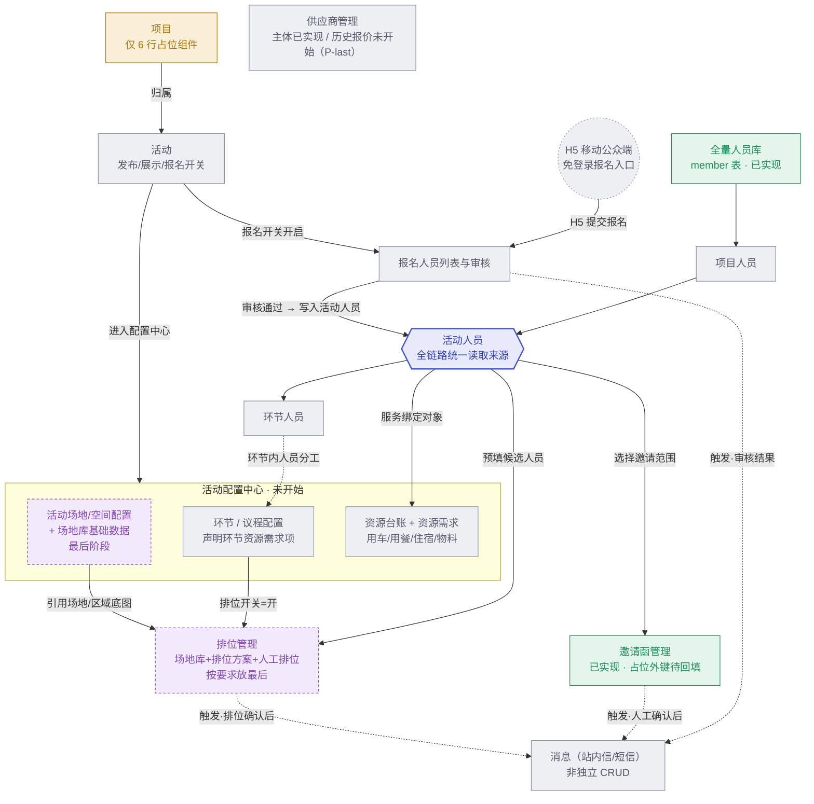

# 项目管理业务域：模块关系与实施路线图

范围依据：[《本期范围与业务方案最终结论单_20260724.md》](20260811交接/本期范围与业务方案最终结论单_20260724.md)、[《活动运营平台一版本项目落地说明文档_开发版_20260804.md》](20260811交接/活动运营平台一版本项目落地说明文档_开发版_20260804.md)；页面参照 [`20260811交接/prototype/admin`](20260811交接/prototype)。现状核对直接读了 `apps/server/src/modules` 和 `apps/web/src/routes` 源码，并对照 [crud-page-guide.md](crud-page-guide.md) 的 CRUD 范式，不是只看文档推断的。

**结论先行**：项目管理不是一个独立菜单，是"项目 → 活动 → 活动配置中心（环节/场地/资源）→ 人员分层 → 报名/邀请函/排位 → 消息"贯穿的一整条主链路，**活动人员是全链路唯一的数据枢纽**。按用户要求，**场地管理与排位管理放在最后阶段**考虑——这恰好也是全图依赖最多的分支，两点结论一致。

## 1. 现状：代码库里真正建成的，和纸面上"应该有"的

| 模块 | 状态 | 依据 | 在本链路中的角色 |
| --- | --- | --- | --- |
| 认证 / 文件上传 | ✅ 已实现 | `modules/auth`, `modules/file` | 基础设施，供邀请函文件、资源附件等复用 |
| 全量人员库 | ✅ 已实现 | `modules/member`（含 `activityCount` 冗余占位列） | 人员分层的地基 |
| 供应商主体 | ✅ 已实现 | `modules/supplier` | 独立域，本期不接入活动资源台账 |
| 供应商历史报价 | ⬜ 未开始 | 无 quotes 表 | 文档标注 P-last，附件留档，不做比价 |
| 邀请函管理（后台） | ✅ 已实现 | `modules/invitation`：`projectId`/`activityId` 是显式可空占位列 | 抢跑建成，等活动模块落地后要回填外键 |
| 项目 | 🟡 仅占位 | `routes/project/list.tsx` 6 行 `PagePlaceholder`；服务端无 `project` 目录 | 主链路起点 |
| 活动 | ⬜ 未开始 | 前后端均无 | **全局阻塞点**——下面所有子模块都挂在"活动"下 |
| 活动配置中心 / 环节议程 / 资源台账 | ⬜ 未开始 | — | 依赖活动先建成 |
| 人员分层（项目/活动/环节人员） | ⬜ 未开始 | member 表只有独立于活动的 `activityCount` 冗余计数 | 报名、邀请函选人、资源绑定、排位共同的读取来源 |
| 报名审核 | ⬜ 未开始 | — | 活动人员关系的第二个生产者（另一个是后台直接新增/导入） |
| 场地库 / 活动场地空间配置 | 🟣 最后阶段 | — | 按要求推迟 |
| 排位管理 | 🟣 最后阶段 | — | 依赖最多的模块（活动 + 场地 + 环节 + 活动人员），按要求推迟 |
| 消息（站内信/短信） | ⬜ 未开始 | — | 不是独立 CRUD，是各业务动作的副作用 |
| 系统管理（角色/权限） | 🟡 仅占位 | `system/role.tsx`、`system/user.tsx` 各 6 行 | 横切能力，不阻塞主链路，可穿插补 |

## 2. 关系图：谁依赖谁

图例：绿色=已实现，黄色=仅占位，灰色=未开始，紫色虚线=最后阶段（按要求推迟）；实线=结构/数据依赖，虚线=触发或尚未建成的入口；六边形=全链路数据枢纽。

供应商管理在图中刻意不连任何箭头——本期它是独立域，不接入活动资源台账，缺席的连线本身就是结论。

## 3. 实施路径与优先级

阶段编号即建设顺序。`P0`/`P1`/`P-last` 标签对齐 `docs/20260811交接` 原文的优先级口径。

### Phase 0 · 已完成基座（无需重做）

auth / file / member / supplier / invitation 已按 supplier 的 CRUD 范式（`schema.ts` + `validation.ts` + `routes.ts` 三件套）落地，直接作为后续模块的抄写模板。

- 登录鉴权、文件上传（供邀请函文件、资源附件复用）
- 全量人员库、供应商主体、邀请函管理（模板/生成/记录）

依赖：无

### Phase 1 · 项目 + 活动 骨架 — `P0`

**为什么排第一**：`member.activityCount`、`invitation.projectId/activityId` 已经是代码里写明的占位列——这是当前唯一真正卡住后面所有模块的缺口，必须第一个补。

- project / activity 最小 CRUD：名称、时间、地点、主办/承办单位、简介
- 业务状态（未开始/进行中/已结束）与发布状态（未发布/已上架/已下架）
- 活动级展示开关、报名开关（各自独立字段，不等同于上架）

依赖：Phase 0

### Phase 2 · 人员分层关系表 — `P0`

**为什么排第二**：报名审核、邀请函选人、资源人员绑定、排位候选人员——四个下游全部读取"活动人员"。不先建统一的关系表，每个模块会各自发明一套参与人员逻辑，后面必然要推翻重来。

- 项目人员 / 活动人员 / 环节人员三层关系表
- 下级入口新增人员时自动补齐上级关系（环节人员 → 同步活动人员 + 项目人员）
- 数据来源字段只读展示，由系统按入口自动生成，不给业务员手改

依赖：Phase 1

### Phase 3 · 活动配置中心骨架 + 环节 / 议程 — `P0`

**为什么排第三**：议程是一场活动的骨架，且按文档口径不要求先有场地图或资源记录——环节字段和议程线校验合法就能保存，这条支线可以和 Phase 2 并行推进。

- 活动配置中心总览（配置项完成情况，展示已配置/总项，不做百分比）
- 环节 CRUD：名称、类型、时间、议程线/展示线路、地点文本
- 议程时间轴按开始/结束时间自动生成串并行，不支持拖拽排序
- 环节资源需求项声明（仅"是否开启 + 处理要求"，不含实际资源记录）

依赖：Phase 1

### Phase 4 · 报名审核 + 邀请函收口 — `P1`

**为什么排第四**：这是把"抢跑"建好的邀请函模块真正接回主链路的时刻——占位列不是新建列，是给已有列补外键约束和数据回填。

- 后台报名人员列表与审核，审核通过写入活动人员关系
- H5 报名表单（公众报名入口，专属活动链接/二维码）
- `invitation.projectId/activityId` 补外键约束；选人范围改为读取活动人员

依赖：Phase 1、2

### Phase 5 · 资源记录与绑定 — `P1`

**为什么排第五**：Phase 3 只声明了"这个环节需要什么资源"，这一阶段把声明落成真正的记录，形成闭环；供应商历史报价文档里本就标注 P-last，顺路一起做。

- 活动级资源台账：用车、用餐、住宿、物料
- 人员服务绑定 + H5 本人查看（不做派单、执行回执）
- 供应商历史报价：附件留档，独立权限点，不做比价

依赖：Phase 2、3

### Phase 6 · 消息闭环 — `P1`

**为什么排第六**：消息是各业务动作的副作用，必须等触发它的业务先落地——没有真实的报名/邀请函动作，消息模块无事可接。

- 系统管理下的消息规则、发送记录查询能力
- 接入触发点：报名结果、邀请函提醒、行程变更（座位通知留给 Phase 7）
- 站内信必做；短信按供应商材料到位情况先接任务和记录，晚接真实发送

依赖：Phase 4

### Phase 7 · 场地管理 + 排位管理（按要求放最后）

**为什么放最后**：全图依赖最多的分支——要同时等到活动（1）、活动人员（2）、环节且排位开关已开（3）三样都齐了才能开始。依赖链最长，加上已明确要求推迟，两点结论一致。

- 场地库：可复用的场地/区域/座位基础数据
- 活动场地/空间配置：活动级底图，供环节排位引用
- 环节排位方案：人工排位、保存即待确认、确认/退回/作废
- H5 本人座位查看；座位通知接入消息闭环

依赖：Phase 1、2、3

## 4. 跨阶段必须守住的设计原则

这些不是某一个阶段的任务，是贯穿整条链路、一旦做错后面全部阶段都要返工的地方。

1. **人员分层不能塌成一张表。** 活动人员的来源/分组/负责人只能挂在活动人员关系表，绝不能回写全量人员主档——否则换一场活动，人员基础信息就被污染了。
2. **"环节资源需求项"和"活动级资源记录"是两张表、两个状态机。** 前者是 Phase 3 的声明（要不要、谁负责），后者是 Phase 5 的实际记录（车/司机/人员绑定）。合并成一张表，将来无法区分"声明了但没落实"和"根本没声明"。
3. **邀请函的占位列是待回填，不是待新建。** Phase 4 做的是给 `invitation.projectId/activityId` 补外键约束和历史数据回填，不要顺手建一套新列造成两套外键并存。
4. **排位方案强关联"环节"，不是"活动"。** 一个环节最多一个当前生效版本；同一场地区域可以被多个环节复用，但排位结果互不覆盖——Phase 7 落地时容易图省事按活动建一个统一方案，要按住。
5. **报名开关 ≠ 活动上架。** H5 可报名要同时满足项目已上架、活动已上架、展示开关开启、报名开关开启、活动未结束——五个条件独立存在，联调时最容易被简化成一个字段。

---

配套的可视化版本（关系图 + 时间轴样式路线图）：<https://claude.ai/code/artifact/e227c272-8704-41f3-b5a8-77c54cb062d6>
