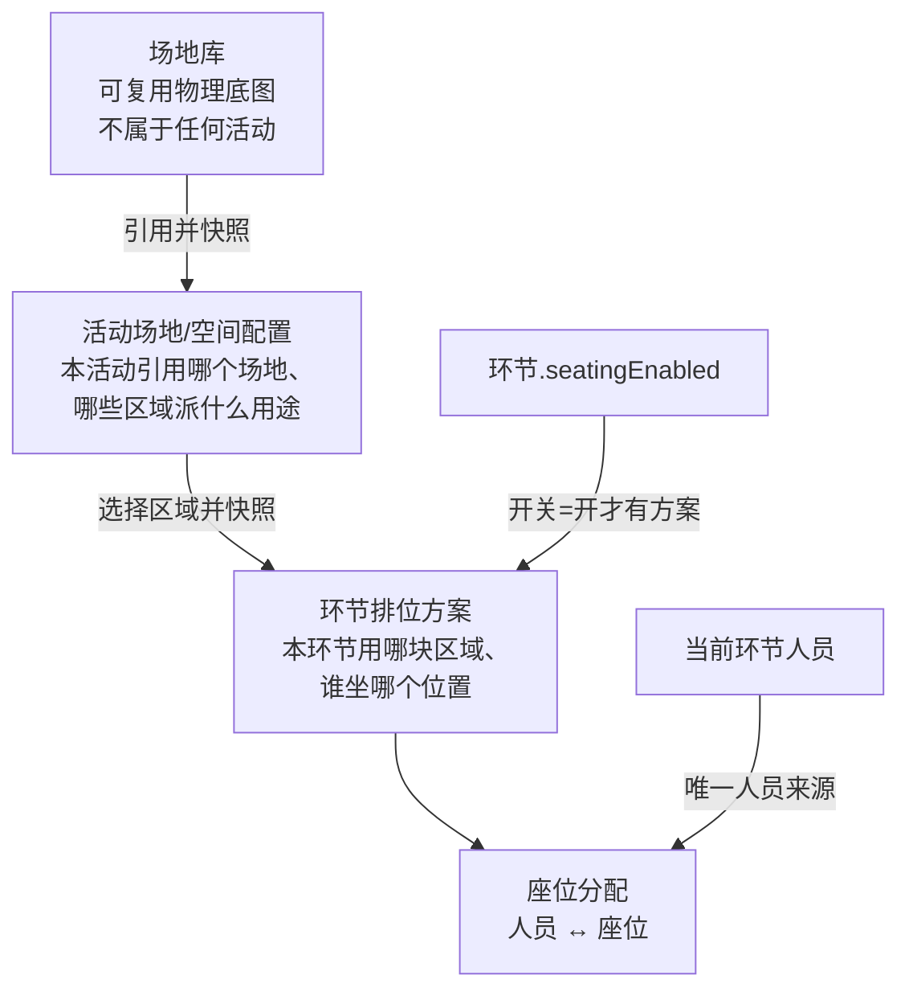
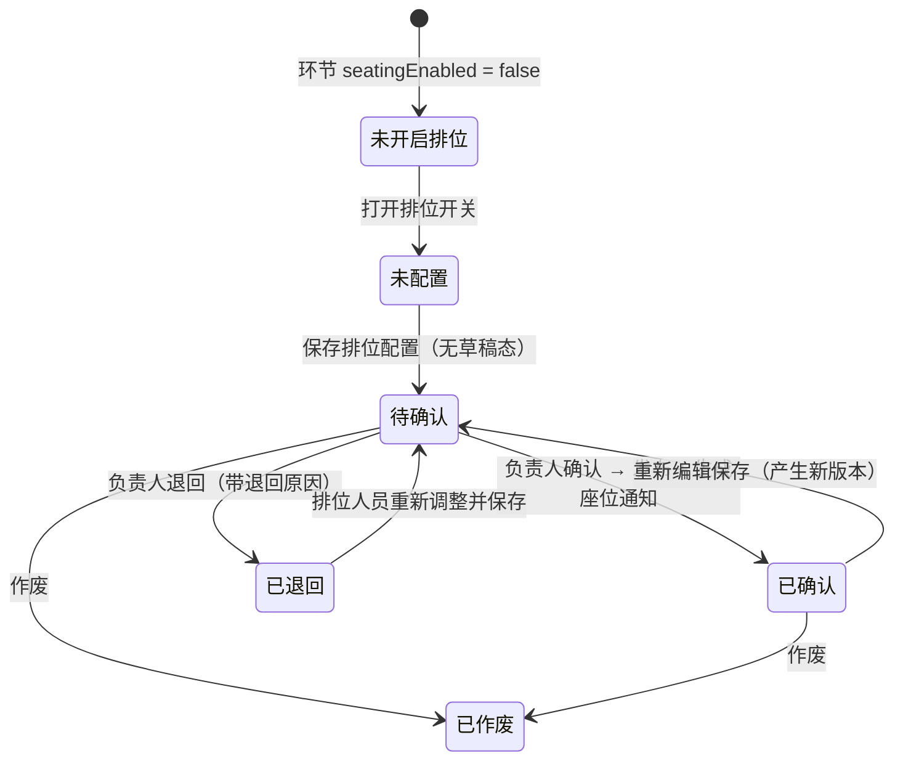

# 场地与排位

> 梳理性文档，不是设计定稿。目的是把**原型 / 两份文档 / 旧系统**三处对场地和排位的说法摊到一起，标出它们打架的地方，给出取哪一边的理由。
>
> 模块本身按 [docs/project-management-roadmap.md](project-management-roadmap.md) 排在 Phase 7（最后阶段），本文不动代码。
>
> 可分享的网页版：<https://claude.ai/code/artifact/27a46e10-7b78-49ca-857c-5721d4faa3e5>（内容与本文一致，改了要一起改）

---

## 0. 一句话结论

**场地是"可复用的物理底图"，排位是"某个环节把人放到底图的某块区域上"——两者之间隔着一层活动级快照，三层都不能省，但每层的写入口只有一个。**

三处材料对这句话的分歧集中在两点：**中间那层活动快照要不要**（旧系统没做），以及**排位有几个状态**（两份文档给了两套）。

---

## 1. 三处材料各说了什么

| | 结论单 20260724 | 开发版 20260804 | 原型 | 旧系统 |
| --- | --- | --- | --- | --- |
| 分层 | 场地功能图 → 环节排位图 → 排位方案 | 场地库 → 活动场地/空间配置 → 环节排位方案 | 同开发版（`venue-library` → `activity-space` → `seating-canvas`） | **两层**：场地模板库 → 环节排座实例，没有活动层 |
| 场地底图 | 区域、功能、通道、固定设施、固定物理座位 | 场地、区域、座位编号/点位 | 区域框 + 类型 + 点位数 + 固定设施 | 自由画布：分区/矩形/椭圆/多边形/画笔/文字，整份存 JSON |
| 座位编排 | 座位、桌位、站位、指定位置、位置顺序、重要等级 | 只说"座位/点位" | 静态 `A1…D6` 方格 | 9 种布局预设 + 12 种家具组件 + 自动布局引擎 |
| 状态 | 未排位/排位中/已保存/待确认/已确认/退回修改/已导出/已作废（8 个） | 待确认/已确认/已退回/已作废，**保存即待确认，无草稿** | 未配置/待确认/已确认/已退回/已作废 | **没有状态**，保存即生效 |
| 自动排位 | 可选自动补齐 + 团体相邻规则辅助 | R-007 不做智能排位，只做人工 | 有个"批量排位"按钮，无行为 | 已实现：VIP 关键词、同用途连续、前排优先/从左到右、保留已有人工排座 |
| 确认/退回 | 有 | 有，属高风险操作 | 有（`seating-confirm.html`，运营人员按钮禁用） | **无** |
| 现场 | — | 不建移动执行端 | — | 已实现签到 / 撤销签到 / 临时换座 + 操作日志 |

**取舍：以开发版 20260804 为准。** 它比结论单晚 11 天、标题就叫"开发版"，且原型是照它画的——三点一致时没有理由回头采信结论单。结论单里被开发版收窄掉的东西（8 状态、自动补齐、导出）按"本期不做、字段不预留"处理。

旧系统的价值不在结论，在**实现细节**：它把结论单那句"座位、桌位、站位、指定位置、位置顺序、重要等级"真正落成了代码，可以直接抄形状（见 §5.3）。

---

## 2. 分层模型



**每层只有一个写入口，跨层只读加快照**：

| 层 | 归属 | 写入口 | 存什么 | 不存什么 |
| --- | --- | --- | --- | --- |
| 场地库 | 全局 | 排位管理 / 场地库 | 区域、固定设施、座位/点位底图 | 任何活动、环节、人员信息 |
| 活动场地空间 | 活动 | 活动配置 / 场地空间 | 引用了哪个场地 + 区域用途/可用点位的**活动级快照** | 人员座位结果（BR-DEV-038A） |
| 环节排位方案 | 环节 | 排位管理 / 排位画布 | 用了哪块区域 + 本环节的座位编排**快照** + 状态/版本 | 不改写上面两层 |

### 2.1 中间那层为什么不能砍

旧系统砍掉了活动层：`FASHION_SEGMENT_SEATING` 直接存 `venue_id + zone_element_id + 快照`，环节跳过活动直接指场地模板。省一张表，代价是三件事没有落脚点：

- **区域用途按活动变**。同一个"主会场 A 区"，这场活动当主席台、下场活动当媒体区——用途是活动级事实，写进场地库会污染其他活动，写进环节会在多个环节间重复。
- **"这块区域这场活动不用"** 没地方声明。原型 `activity-space.html` 的"禁用区域"和"可用点位 236 < 场地 260"就是这个。
- **资源需求汇总要读它**。BR-DEV-033C：场地类需求点"去配置"跳的是活动场地空间配置，不是场地库也不是排位方案。没有这层，那个跳转没有落点。

所以：**保留三层，但中间层是薄的**——它是一份可编辑的引用快照，不是第二个画布编辑器。

### 2.2 快照，不是外键

同一块活动区域可以被多个环节引用，且**各环节的排位结果互不覆盖**（BR-DEV-038A、AC-DEV-010A）。这意味着环节排位方案不能只存一个 `zoneId` 然后实时去读区域——上游区域改了尺寸/座位数，下游已确认的排位就会静默变形。

旧系统的做法是对的，直接抄：环节保存时把整块区域（几何 + 座位编排）**整份复制**进自己的方案里（`SegmentSeatingSnapshot.zone` + `.plan`，见 `ruoyi-antdp/src/pages/project/activity/seating/service.ts`）。上游变了，环节侧显式提供一个"重新从场地模板同步"的动作，二次确认后才覆盖——旧系统的 `handleResyncTemplate` 就是这个，`operations` 里记一条 `sync_template`。

同理，活动场地空间引用场地库，也是快照 + 手动同步，不是活引用。

---

## 3. 场地库

### 3.1 业务定义

跨项目、跨活动复用的场地物理底图。不属于任何活动，也不知道任何人员。

### 3.2 字段与操作

| | 内容 | 依据 |
| --- | --- | --- |
| 列表字段 | 场地名称、地址/城市、区域数、座位/点位数、最近引用活动、状态 | 原型 `venue-library.html` |
| 详情字段 | 名称、地址、说明、区域列表（名称/类型/点位数/固定设施/状态）、画布 | 原型 + 开发版 §8.5 |
| 区域类型 | 座席区 / 功能区 / 签到区 / 物料区 | 原型 `venue-workbench.html` 的区域编辑弹窗 |
| 操作 | 新增、编辑、画布编辑、引用到活动、禁用/启用、删除 | 原型 + 旧系统 |

旧系统另有 **`config_status: draft / published`**（画布画完要"发布"才算可用）和 Excel 导出。两份文档和原型都没提这两件事。建议：

- **发布态：不做。** 文档口径里场地库只是基础数据，加个发布态就要回答"草稿态能不能被活动引用""引用后场地改回草稿会怎样"，收益抵不上这两个问题的成本。用 `enabled/disabled` 一个状态够了。
- **导出：不做。** 本期验收清单（AC-DEV-010 系列）没有场地导出。

### 3.3 删除保护

旧系统的规则是"已发布且启用的场地不可删除，请先禁用"。新系统按仓库既有口径来（开发版 §7.4 第 5 条）：**被引用的不物理删除**，走禁用/作废，记操作日志。判断"被引用"= 存在任一活动场地空间配置指向它。

---

## 4. 活动场地/空间配置

### 4.1 业务定义

本活动使用的空间底图。从场地库引用生成，之后可按本活动需要调整，**不回写场地库**。

### 4.2 关键规则

1. **不是环节保存的前置条件**（BR-DEV-031A）。普通环节的地点先用一行文本录入就行；只有需要精确空间或要排位时才进这里。
2. **不保存人员座位结果**（BR-DEV-038A）。这层只有区域和点位。
3. 区域字段：活动区域名称、来源场地区域、**活动用途**（主线环节排位 / 分论坛洽谈 / 签到物料 / 备用区域）、可用点位、引用环节、状态。
4. 一个活动理论上可引用多个场地（原型统计卡写"引用场地 1"，但没有排除多个）。**建议本期就按多条处理**，因为一场活动跨馆很常见，做成一对一后面拆很贵。

### 4.3 它的下游读者

| 读者 | 读什么 | 依据 |
| --- | --- | --- |
| 环节排位方案 | 可选的区域清单 | BR-DEV-038A |
| 资源需求汇总 | 场地/空间类需求的"是否已有底图" | BR-DEV-033C |
| 活动配置总览 | `venue` 配置项的完成状态 | `activity-config/routes.ts` 的 `checkVenue`：有可用区域即已配置；一个环节都没开排位时不适用 |

---

## 5. 环节排位方案

### 5.1 归属：环节，不是活动

这条是全模块最容易做错的地方，roadmap 的"跨阶段原则 #4"专门点了名：

- 排位方案**必须**强关联一个具体环节（BR-DEV-010、AC-DEV-010）
- 一个环节最多一个**当前有效**方案，历史版本留版本号（开发版 §8.3 规则 3）
- 同一活动区域被多个环节引用时，各环节分别保存，**任一环节调整不得覆盖其他环节**（AC-DEV-010A）

原型 `seating-list.html` 的列表就是按环节一行；旧系统 `FASHION_SEGMENT_SEATING` 也是 `segment_id` 维度。两边一致，没有争议。

### 5.2 状态机

落库状态只有 4 个，另有 2 个是**派生**的展示态，不落库：



| 状态 | 落库 | 含义 | 依据 |
| --- | --- | --- | --- |
| 未开启排位 | 否，读 `activity_segment.seatingEnabled` | 本环节不需要排位 | 开发版 §8.3 显示规则 1 |
| 未配置 | 否，= 开关已开但无方案行 | 开了开关还没排 | 显示规则 2 |
| 待确认 | 是 | 保存即此状态，**不存在草稿** | BR-DEV-010、显示规则 3 |
| 已确认 | 是 | 结果对外生效，触发座位通知 | 显示规则 4 |
| 已退回 | 是 | 带退回原因，可重新编辑 | 显示规则 5 |
| 已作废 | 是 | 不再作为当前结果 | 显示规则 6 |

**"未配置"不要落成一行状态为未配置的方案记录。** 它是"环节开关开了 + 方案表里没有行"的派生结论，落行会立刻产生"开关关掉后这行算什么"的垃圾状态。

状态必须出现在四处：环节/议程列表、排位方案列表、排位画布页、排位确认列表；活动详情页只给入口和待办提示，**不重复展示每个环节的排位明细**（BR-DEV-011）。管理员和负责人必须能筛"待确认"（BR-DEV-012）。

### 5.3 座位与编排

这是本期工作量最不确定的地方——**原型和旧系统差了一个数量级**：

- 原型 `seating-canvas.html`：一个静态 `A1…D6` 方格 + 点击弹窗绑人
- 旧系统：`ruoyi-antdp/src/pages/venue/config/seating/`，1165 行画布 + 740 行布局引擎 + 558 行家具目录

旧系统的模型（`config/types.ts`）值得直接采用，因为它正好逐条命中了结论单 C-006 那句需求：

| 结论单说的 | 旧系统的实现 |
| --- | --- |
| 座位、桌位、站位 | `SeatFurnitureKind`：seat / table / roundTable / longTable / squareTable / barTable / sofa / stage / podium / plant / buffet / screen |
| 指定位置 | `SeatItem.x/y/rotation`，自由拖拽 |
| 位置顺序 | `SeatingParams.numbering`：`row-col` / `sequential` / `table-seat` + `startRowLabel` |
| 重要等级 | `SeatStatus`：`available` / `vip` / `blocked` |
| 团体相邻 | `SeatGroup`（分组名 + 颜色 + seatIds），如"安踏人员" |
| 启用哪些座位 | `blocked` 状态的座位不计入可用数（`countSeats`） |
| 布局辅助 | 9 种预设：剧场直排 / 课堂纵列 / 圆桌宴会 / U 型围合 / 董事会长桌 / **秀场双边** / 酒会散座 / 弧形看台 / 自由排座 |

秀场双边（中间留 T 台通道，两侧看台）这一项特别值得留意——这是时尚周的主场景，从零设计大概率想不到。

**建议**：座位几何和编排参数照旧系统的 `SeatingPlan` 结构走（`preset` + `params` + `seats[]` + `groups[]`），布局引擎可以先只实现剧场/宴会/秀场三种预设 + 自由摆放，其余预设后补。

### 5.4 人员绑定

| 规则 | 内容 | 依据 |
| --- | --- | --- |
| 来源 | 排位画布只展示**当前环节人员**；活动人员必须先建立当前环节关系，不能直接排未审核的报名人员 | BR-DEV-009、排位画布交互口径 |
| 一人一座 | 同一方案内一个人员只能占一个座位（旧系统 `SeatAssignDrawer` 把已占座人员置灰） | 旧系统实现 |
| 冲突处理 | 座位冲突阻断确认，提示人工调整 | 开发版 §7.5 异常表 |
| 解绑 | 人员从活动/环节移除时一并解除排位绑定，需展示清单 + 二次确认，确认后不可复原 | 开发版 §7.4 |
| 手动为主 | 本期只做人工绑定/调整/解除/对调 | R-007 |

旧系统的自动排座（`AutoSeatModal`）规则很轻——保留已有人工排座、VIP 关键词命中优先进 VIP 座、同用途人员尽量连续、普通座位前排优先或从左到右。**本期按 R-007 不做**，但这四条规则是现成的，将来要做时不用重新设计。

### 5.5 操作留痕

旧系统把操作日志塞进了 `plan_json` 的 `operations[]` 数组（滚动保留最近 500 条），类型有 `save / sync_template / auto_assign / manual_assign / check_in / cancel_check_in / change_seat`。

**这个位置是错的，不要抄。** 日志混在快照里，导致每次读日志都要反序列化整份画布，也没法按人员或时间检索。新系统落成独立的操作记录表，或者复用仓库既有的 revision 快照模式（见 `activity_segment_revision`）。

---

## 6. 与已建模块的接缝

| 已建模块 | 接缝 | 现状 |
| --- | --- | --- |
| `agenda` | `activity_segment.seatingEnabled` 是排位方案存在的前提；环节列表要加"排位状态"列 | 字段已存在（`agenda/schema.ts:180`），注释明确写了"本期只是声明，没有下游接上" |
| `activity-config` | ✅ 已接入。`checkVenue` / `checkSeating` 实算，`module_pending` 状态已删除 | 排位的适用范围出自 `seating/stats.ts`，和排位页同一处定义 |
| `resource` | 资源类型里**故意没有**场地和排位 | `resource/schema.ts` 的注释已经把理由写死：这两类应做成**只读派生视图**（场地读活动空间配置的存在性，排位读 `seatingEnabled` + 方案状态），不在需求表里落可写行 |
| `member` | 当前环节人员是排位唯一人员来源；移除人员要级联解绑 | 人员分层已建（Phase 2） |
| 消息 | 确认发布后生成座位通知（MSG-004 / SMS-SEAT-001），可人工重发 | 消息模块未建，Phase 6 |

**环节作废的连锁**：作废后不进入新排位、不进入座位通知（BR-DEV-003B），已有历史记录和日志保留、不物理删除。

---

## 7. 数据模型草案

开发版 §8.5 给的对象清单是：场地库 / 活动场地空间配置 / 座位 / 排位方案 / 座位分配。落到本仓库的取舍是**几何存 JSON、人座关系落表**：

```
venue                   场地库主记录（名称、地址、说明、状态）
venue_canvas            画布 JSON（区域几何 + 座位底图）——大字段单独一张表，列表不查
activity_venue          活动引用的场地（活动ID + 场地ID + 使用说明 + 状态）
activity_venue_zone     活动区域（来源区域快照 + 活动用途 + 可用点位 + 状态）
segment_seating_plan    环节排位方案（环节ID + 活动区域ID + 状态 + 版本 + 保存人/时间 + 确认人/时间 + 退回原因）
segment_seating_canvas  方案画布 JSON（区域快照 + 座位编排快照）
seat_assignment         座位分配（方案ID + 环节ID + 活动人员ID + seatId + seatLabel 快照）
```

### 为什么人座关系要单独落表

旧系统把 assignee 塞在 `plan_json` 的座位对象里，于是"这个人坐哪"只能把整份 JSON 拉出来遍历——`FashionParticipantPortalServiceImpl.findSeatLabel()` 正是这么写的，H5 每查一次座位就全量解析一次画布 JSON。

新系统有三个场景必须按人员反查：人员被移除时要级联解绑、确认后要生成通知名单、将来 H5 要查本人座位。**几何留在 JSON 里（它天然是整体保存的），人 ↔ 座位关系落成关系行**，两个诉求各归其位。

### 版本

"一个环节最多一个当前有效方案 + 历史版本留版本号"。方案表上放 `version`，历史进独立的快照表（同 `activity_segment_revision` 的模式：只写不读，先不建查询接口）。

---

## 8. 本期不做

1. 智能排位、复杂自动最优算法、自动补齐、冲突自动检测（R-007、结论单 §8）
2. 现场签到、撤销签到、临时换座（不建移动执行端；旧系统已实现，可作后续参考）
3. 排位结果导出/打印，以及结论单里的"已导出"状态（开发版已砍，字段不预留）
4. 场地库的发布态（draft/published）和 Excel 导出
5. H5 本人座位查看、座位通知的 H5 落地端（AGENTS.md：H5 本期都不做）——但**确认动作本身要做**，它是排位的状态终点，不是 H5 的附属品
6. 场馆运营、设备巡检、并发编辑、画布回滚

---

## 9. 待业务确认

按结论单遗留项 T-006 / T-009 / T-010 加上本次梳理新发现的，一并列出：

| # | 问题 | 影响 |
| --- | --- | --- |
| 1 | 一个活动能否引用多个场地？ | 决定 `activity_venue` 是一对一还是一对多，事后拆很贵 |
| 2 | 排位画布要做到旧系统的哪一档？9 种预设 + 12 种家具，还是先做剧场/宴会/秀场三种？ | 本模块最大的工作量变量 |
| 3 | 上游区域改动后，下游环节方案的"同步"是手动触发（旧系统）还是给提示？已确认的方案能不能被同步覆盖？ | 影响快照一致性设计 |
| 4 | 已确认的方案重新编辑，是回到待确认还是新开一个版本并保留旧版生效？ | 状态机分支，也影响 H5 将来读哪一版 |
| 5 | 排位确认/退回的角色边界：运营人员"单独授权"具体怎么授？旧系统拆了 view/edit/operate/print 四个权限点 | 权限矩阵（T-006） |
| 6 | 座位冲突的判定范围：只管同一方案内，还是跨同时段环节也算冲突（一个人同时被排进两个并行环节）？ | 校验实现范围 |
| 7 | 团体相邻本期做到什么程度？旧系统的 `SeatGroup` 是纯人工分组着色，没有自动约束 | 影响是否需要分组数据结构 |

---

## 附：材料索引

| 材料 | 位置 |
| --- | --- |
| 结论单 | `docs/20260811交接/本期范围与业务方案最终结论单_20260724.md`，C-006 |
| 开发版文档 | `docs/20260811交接/活动运营平台一版本项目落地说明文档_开发版_20260804.md`，§6.7 / §8.3 / §8.5 / BR-DEV-038 系列 |
| 原型 | `docs/20260811交接/prototype/admin/`：`venue-library` `venue-workbench` `activity-space` `seating-list` `seating-canvas` `seating-confirm` |
| 旧系统后端 | `../fashion_actions_management`：`FashionVenueController/ServiceImpl`、`FashionActivitySegmentResourceServiceImpl`（seating 部分）、`db/fashion_venue_tables.sql`、`db/fashion_segment_resource_tables.sql` |
| 旧系统前端 | `../ruoyi-antdp/src/pages/venue/`（场地库 + 画布 + 排座编辑器）、`src/pages/project/activity/seating/`（环节排位实例） |
